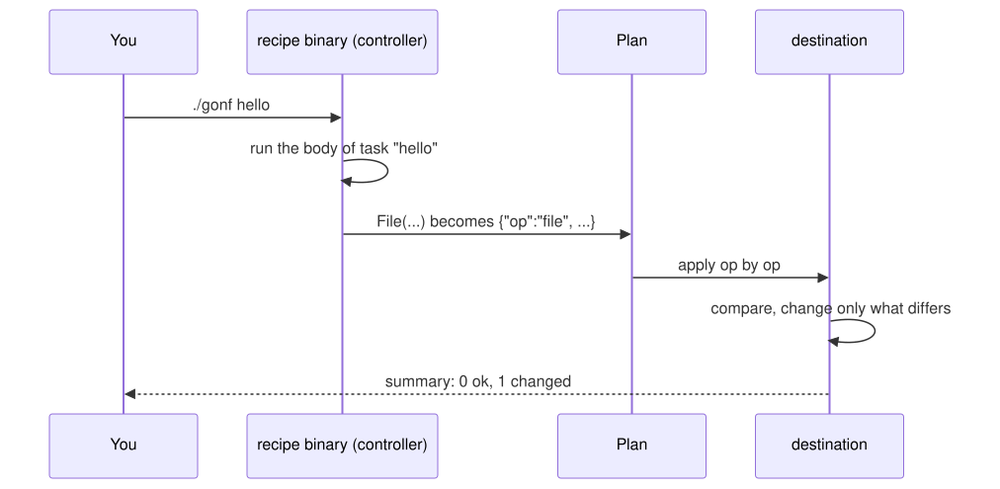

# 1. How gonf works

gonf is configuration management written as a plain Go program. There is
no agent to run, no YAML and no template language of its own: you write a
Go `main` package that describes the state you want, build it, and run it.

> 🦫 **Gonfy says:** A beaver does not rebuild his lodge every morning. He walks around it, finds the stick that moved, and puts it back. That is all gonf does with your machines, and this chapter shows how.

## The words

> 🦫 **Gonfy says:** Six words and you can talk shop with any beaver.

| Word | Meaning |
|------|---------|
| **recipe** | Your Go program. It registers tasks and ends with `cli.Main()`. |
| **task** | A named function. Its body declares resources. `./gonf -list` shows the tasks. |
| **resource** | One thing to converge: a file, a directory, a package, a service, a cron job, a user, a command. |
| **controller** | The machine where the recipe runs. Task bodies, secrets and Go `if`s run here. |
| **destination** | The machine that applies the result. Often the same machine, sometimes a remote host. |
| **plan** | The recorded result: versioned JSON lines, one op per resource, plus a blob store for big files. |

Reference: [Concepts](../reference.md#concepts).

## Record, then apply

Running a task never touches the system while your Go code runs. gonf first
**records** the task: it runs the task body once, and every resource you
declare becomes an op in a plan. Then it **applies** the plan: for each op
it checks the current state, and changes only what differs.



Because the plan is data, the same plan can be applied in three ways:

```text
./gonf hello                  record and apply here, in one go
./gonf plan -o out hello      write out/plan.jsonl, apply it later with
gonf apply out/plan.jsonl       ... any gonf binary, on any host
./gonf push user@host hello   record here, stream it over ssh, apply there
```

There is one apply engine behind all of them, so a task behaves the same
locally, from a file and over ssh.

## What runs where

> 🦫 **Gonfy says:** The riverbank is where I gather sticks, the lodge is where they go. Keep the two apart in your head and nothing here will surprise you.

This split is the one thing to keep in mind while reading the rest of the
book.



An `if hostname == "web"` in a task body runs on the controller and never
reaches the plan. To let the destination decide, use a guard such as
`WhenLinux()` or `WhenHostname(...)` (chapter 9).

Reference: [Concepts](../reference.md#concepts),
[Where guards are evaluated](../reference.md#where-guards-are-evaluated).

## Idempotence

> 🦫 **Gonfy says:** I describe the lodge, not the chores. That is why a second walk around it finds nothing to do.

Every resource describes an end state ("this file has this content and mode
0644"), not an action ("write this file"). Running the same task twice
changes nothing the second time. The summary line at the end of every run
tells you what happened:

```text
summary: 14 ok, 2 changed, 0 skipped, 0 would-change
```

- **ok**: already as declared.
- **changed**: gonf changed it.
- **skipped**: a guard or change gate held it back.
- **would-change**: a dry run (`-n`) found a difference.

---

[Contents](README.md) · Next: [2. Your first recipe](02-first-recipe.md) →
