# 4. Editing and validating files

Some files are shared: other tools, packages or people write to them too.
gonf can own just a part of such a file. It can also refuse to install a
file that does not pass a check, and install several files as one checked
set.

> 🦫 **Gonfy says:** Some lodges are shared with the muskrats. I only fix my own sticks and leave theirs where they are: that is what owned lines, keyed lines and blocks are for.

## The recipe

```go
// Command gonf edits and validates files (tutorial chapter 4).
package main

import (
	"os"

	. "github.com/snonux/gonf/api"
	"github.com/snonux/gonf/cli"
)

func main() {
	Task("lines", "Own single lines and a block of ~/gonf-tutorial/app.conf", lines)
	Task("script", "Install a shell script only if it parses", script)
	Task("greeter", "Install two scripts that must work together", greeter)
	cli.Main()
}

func lines() {
	File(DestHome("gonf-tutorial/app.conf"),
		// Exact lines: added when missing, removed when present.
		WithLines("log_level=info", "color=yes", "mascot=gonfy"),
		WithoutLines("debug=true"),
		// Own "the line starting with port=", whatever its value is today.
		WithKeyedLine("port=", "port=8080"),
		// Own everything between # BEGIN GONF peers and # END GONF peers.
		WithBlock("peers", "peer=10.0.0.1", "peer=10.0.0.2"),
		// Own an rc.conf-style shell variable: greeting="hello from gonfy".
		WithShellVar("greeting", "hello from gonfy"),
		WithMode(0o644))
}

func script() {
	body := envOr("GREETING_SCRIPT", "#!/bin/sh\necho hello from gonfy\n")
	// WithValidation needs an absolute path, and DestHome records the
	// placeholder ${HOME}. Home is the controller's home: the same machine
	// for a local run like this one.
	File(Home("gonf-tutorial/hello.sh"),
		WithContent(body), WithMode(0o755),
		// gonf writes a candidate file, runs "sh -n <candidate>" and only
		// replaces the live file when that exits 0.
		WithValidation("sh", List("-n", CandidatePath)))
}

func greeter() {
	lib := "greet() { echo \"hello, $1\"; }\n"
	main := "#!/bin/sh\n. " + MemberPath("lib.sh") + "\ngreet gonfy\n"
	Dir(DestHome("gonf-tutorial/greeter"), WithMode(0o755))
	set := ConfigSet("greeter",
		ConfigFile("lib.sh", DestHome("gonf-tutorial/greeter/lib.sh"), WithContent(lib), WithMode(0o644)),
		ConfigFile("main.sh", DestHome("gonf-tutorial/greeter/main.sh"), WithContent(main), WithMode(0o755)),
		// Both files are staged together, then the validator runs the
		// staged main.sh, which sources the staged lib.sh.
		WithSetValidation("sh", List(MemberPath("main.sh"))))
	// ${HOME} is not expanded in argv, but it is in WithDir.
	Command("sh", List("main.sh"), WithDir(DestHome("gonf-tutorial/greeter")),
		WithName("run-greeter"), OnChange(set))
}

// envOr returns the environment variable key, or def when it is unset.
// The tutorial uses it to feed a broken script into the "script" task.
func envOr(key, def string) string {
	if v, ok := os.LookupEnv(key); ok {
		return v
	}
	return def
}
```

## Owning parts of a file



Start from a file someone else wrote, then apply `lines`:

```text
$ mkdir -p ~/gonf-tutorial && printf "# app.conf\nport=22\ndebug=true\nuser=paul\n" > ~/gonf-tutorial/app.conf
$ cat /home/paul/gonf-tutorial/app.conf
# app.conf
port=22
debug=true
user=paul
$ ./gonf lines
2026/09/26 08:23:12 file /home/paul/gonf-tutorial/app.conf: keyed line "port=" replaces 1 existing line(s)
2026/09/26 08:23:12 updated /home/paul/gonf-tutorial/app.conf
summary: 0 ok, 1 changed, 0 skipped, 0 would-change
  changed File[/home/paul/gonf-tutorial/app.conf]
$ cat /home/paul/gonf-tutorial/app.conf
# app.conf
port=8080
user=paul
# BEGIN GONF peers
peer=10.0.0.1
peer=10.0.0.2
# END GONF peers
greeting="hello from gonfy"
log_level=info
color=yes
mascot=gonfy
$ ./gonf lines
summary: 1 ok, 0 changed, 0 skipped, 0 would-change
```

- `WithKeyedLine("port=", "port=8080")` replaced `port=22` in place.
- `WithoutLines("debug=true")` removed that line.
- `WithBlock` appended the marked region, `WithLines` and `WithShellVar`
  appended their lines.
- Everything else (`# app.conf`, `user=paul`) stayed as it was.

Lines outside gonf's ownership stay untouched on later runs too:

```text
$ echo "peer=10.0.0.9" >> ~/gonf-tutorial/app.conf; echo "note=mine" >> ~/gonf-tutorial/app.conf
$ ./gonf lines
summary: 1 ok, 0 changed, 0 skipped, 0 would-change
$ cat /home/paul/gonf-tutorial/app.conf
# app.conf
port=8080
user=paul
# BEGIN GONF peers
peer=10.0.0.1
peer=10.0.0.2
# END GONF peers
greeting="hello from gonfy"
log_level=info
color=yes
mascot=gonfy
peer=10.0.0.9
note=mine
```

`WithShellVar(key, value)` is `WithKeyedLine(key+"=", key+"=\"value\"")`
with the quoting done for you, for `rc.conf`, `rc.conf.local`,
`loader.conf` and similar files.

Reference: [File](../reference.md#file) (keyed lines and managed blocks).

## Validate before installing

> 🦫 **Gonfy says:** I test every new stick before it goes into the dam. A broken one never replaces a working one.

`WithValidation` writes a candidate next to the target, runs your validator
on it, and replaces the live file only when the validator exits 0. The
recipe feeds the script body from `GREETING_SCRIPT`, so you can try a
broken one:

```text
$ ./gonf script
2026/09/26 08:23:12 updated /home/paul/gonf-tutorial/hello.sh
summary: 0 ok, 1 changed, 0 skipped, 0 would-change
  changed File[/home/paul/gonf-tutorial/hello.sh]
$ GREETING_SCRIPT="$(printf "#!/bin/sh\nif then\n")" ./gonf script
summary: 0 ok, 0 changed, 0 skipped, 0 would-change
error: chunk 0: plan: apply line 2: file /home/paul/gonf-tutorial/hello.sh: validation by sh failed: exit status 2: validator output: /home/paul/gonf-tutorial/hello.sh.gonfvalidate963692649: 2: Syntax error: "then" unexpected
[exit status 1]
$ cat /home/paul/gonf-tutorial/hello.sh
#!/bin/sh
echo hello from gonfy
```

The broken script never reached `hello.sh`. Use this for anything a typo can
take down: `sshd -t`, `nginx -t`, `httpd -n`, `visudo -c`.



Reference: [File](../reference.md#file) (validation).

## Several files, one check: ConfigSet

> 🦫 **Gonfy says:** Two sticks that only hold together are checked together, before either touches the lodge.

`main.sh` sources `lib.sh`, so neither can be checked alone. A `ConfigSet`
stages all members in a private directory, runs the validators against the
staged copies (`MemberPath` points at the staged path during validation and
at the live path afterwards), and only then publishes them.

The `greeter` task from `main.go`:

```go
func greeter() {
	lib := "greet() { echo \"hello, $1\"; }\n"
	main := "#!/bin/sh\n. " + MemberPath("lib.sh") + "\ngreet gonfy\n"
	Dir(DestHome("gonf-tutorial/greeter"), WithMode(0o755))
	set := ConfigSet("greeter",
		ConfigFile("lib.sh", DestHome("gonf-tutorial/greeter/lib.sh"), WithContent(lib), WithMode(0o644)),
		ConfigFile("main.sh", DestHome("gonf-tutorial/greeter/main.sh"), WithContent(main), WithMode(0o755)),
		// Both files are staged together, then the validator runs the
		// staged main.sh, which sources the staged lib.sh.
		WithSetValidation("sh", List(MemberPath("main.sh"))))
	// ${HOME} is not expanded in argv, but it is in WithDir.
	Command("sh", List("main.sh"), WithDir(DestHome("gonf-tutorial/greeter")),
		WithName("run-greeter"), OnChange(set))
}
```

- `ConfigFile(name, path, options...)` declares one member. The name is how
  the set refers to it; the path is where it is published. Its content
  comes from `WithContent` or `WithSource`, and `WithMode`, `WithOwner` and
  `WithGroup` work as for `File`.
- `MemberPath("lib.sh")` is the staged `lib.sh` while the validators run and
  the live path once published, so `main.sh` sources the right copy in both
  cases.
- `WithSetValidation(command, argv)` runs against the whole staged set,
  without a shell. If it exits non-zero, no member is published.
- `OnChange(set)` makes the command run only when some member changed.

Apply it:

```text
$ ./gonf greeter
2026/09/26 08:23:12 created directory /home/paul/gonf-tutorial/greeter
2026/09/26 08:23:12 config set greeter: published /home/paul/gonf-tutorial/greeter/lib.sh
2026/09/26 08:23:12 config set greeter: published /home/paul/gonf-tutorial/greeter/main.sh
2026/09/26 08:23:12 running Command[run-greeter]: sh main.sh
summary: 0 ok, 5 changed, 0 skipped, 0 would-change
  changed Directory[/home/paul/gonf-tutorial/greeter]
  changed ConfigSet[greeter]
  changed ConfigSetMember[greeter/lib.sh]
  changed ConfigSetMember[greeter/main.sh]
  changed Command[run-greeter]
$ ./gonf greeter
2026/09/26 08:23:12 skipping Command[run-greeter]: no watched dependency changed
summary: 4 ok, 0 changed, 1 skipped, 0 would-change
```

The `run-greeter` command watches the set with `OnChange`, so it ran on the
first apply and was skipped on the second. Let a woodpecker take Gonfy's
place in `main.sh`, and the set repairs it and fires the command again:

```text
$ sed -i s/gonfy/woodpecker/ ~/gonf-tutorial/greeter/main.sh
$ ./gonf -verbose greeter
2026/09/26 08:23:12 Registered resource Directory[${HOME}/gonf-tutorial/greeter]
2026/09/26 08:23:12 Registered resource ConfigSet[greeter]
2026/09/26 08:23:12 Registered resource ConfigSetMember[greeter/lib.sh]
2026/09/26 08:23:12 Registered resource ConfigSetMember[greeter/main.sh]
2026/09/26 08:23:12 Registered resource Command[run-greeter]
2026/09/26 08:23:12 processing directory: /home/paul/gonf-tutorial/greeter
2026/09/26 08:23:12 directory /home/paul/gonf-tutorial/greeter already exists
2026/09/26 08:23:12 set owner root:0 for /home/paul/gonf-tutorial/greeter
2026/09/26 08:23:12 set mode -rwxr-xr-x for /home/paul/gonf-tutorial/greeter
2026/09/26 08:23:12 config set greeter: validator sh accepted the staged set
2026/09/26 08:23:12 set owner root:0 for /home/paul/gonf-tutorial/greeter/lib.sh
2026/09/26 08:23:12 set mode -rw-r--r-- for /home/paul/gonf-tutorial/greeter/lib.sh
2026/09/26 08:23:12 created temporary file /home/paul/gonf-tutorial/greeter/main.sh.gonftmp411991458
2026/09/26 08:23:12 renaming /home/paul/gonf-tutorial/greeter/main.sh.gonftmp411991458 to /home/paul/gonf-tutorial/greeter/main.sh
2026/09/26 08:23:12 synced directory /home/paul/gonf-tutorial/greeter to make the rename durable
2026/09/26 08:23:12 set owner root:0 for /home/paul/gonf-tutorial/greeter/main.sh
2026/09/26 08:23:12 set mode -rwxr-xr-x for /home/paul/gonf-tutorial/greeter/main.sh
2026/09/26 08:23:12 config set greeter: published /home/paul/gonf-tutorial/greeter/main.sh
2026/09/26 08:23:12 running Command[run-greeter]: sh main.sh
2026/09/26 08:23:12 Command[run-greeter] stdout: hello, gonfy
summary: 2 ok, 3 changed, 0 skipped, 0 would-change
  changed ConfigSet[greeter]
  changed ConfigSetMember[greeter/main.sh]
  changed Command[run-greeter]
```

Reference: [ConfigSet](../reference.md#configset),
[Change gates](../reference.md#change-gates).

## What the plan carries

```text
$ ./gonf plan -redacted lines greeter
{"op":"plan_preview","version":27,"id":"plan"}
{"op":"file","id":"File[${HOME}/gonf-tutorial/app.conf]","path":"${HOME}/gonf-tutorial/app.conf","mode":"0644","add_lines":["log_level=info","color=yes","mascot=gonfy"],"remove_lines":["debug=true"],"keyed_lines":[{"key":"port=","line":"port=8080"},{"key":"greeting=","line":"greeting=\"hello from gonfy\""}],"blocks":[{"name":"peers","lines":["peer=10.0.0.1","peer=10.0.0.2"]}]}
{"op":"dir","id":"Directory[${HOME}/gonf-tutorial/greeter]","path":"${HOME}/gonf-tutorial/greeter","mode":"0755"}
{"op":"config_set","id":"ConfigSet[greeter]","name":"greeter","members":[{"key":"lib.sh","path":"${HOME}/gonf-tutorial/greeter/lib.sh","content_b64":"Z3JlZXQoKSB7IGVjaG8gImhlbGxvLCAkMSI7IH0K","mode":"0644"},{"key":"main.sh","path":"${HOME}/gonf-tutorial/greeter/main.sh","content_b64":"IyEvYmluL3NoCi4gAGdvbmYtbWVtYmVyLXBhdGg6bGliLnNoAApncmVldCBnb25meQo=","mode":"0755"}],"validators":[{"bin":"sh","args":["\u0000gonf-member-path:main.sh\u0000"]}]}
{"op":"config_set_member","id":"ConfigSetMember[greeter/lib.sh]","path":"${HOME}/gonf-tutorial/greeter/lib.sh","name":"greeter","member":"lib.sh","deps":["ConfigSet[greeter]"]}
{"op":"config_set_member","id":"ConfigSetMember[greeter/main.sh]","path":"${HOME}/gonf-tutorial/greeter/main.sh","name":"greeter","member":"main.sh","deps":["ConfigSet[greeter]"]}
{"op":"command","id":"Command[run-greeter]","name":"run-greeter","bin":"sh","args":["main.sh"],"dir":"${HOME}/gonf-tutorial/greeter","if_changed":true,"watch":["ConfigSet[greeter]"],"deps":["ConfigSet[greeter]"]}
wrote redacted preview to stdout (7 ops, 0 secret-bearing; not a plan, cannot be applied)
```

The line edits travel as edits, not as a whole file: `add_lines`,
`remove_lines`, `keyed_lines` and `blocks` are applied to whatever
`app.conf` holds on the destination. The config set is one `config_set` op
with its members and validators; `MemberPath` is still a placeholder,
filled in on the destination when the set is staged and published. Each
member also gets its own `config_set_member` op, which is what
`ConfigSetMember[...]` in the summaries refers to.

---

← [3. Files, directories and links](03-files.md) · [Contents](README.md) · Next: [5. Templates](05-templates.md) →
