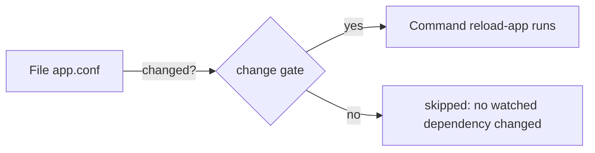

# 6. Commands and change gates

When no resource fits, run a command. A command is a resource like any
other, so it should be idempotent too: gonf gives you guards that decide on
the destination whether to run it, and change gates that run it only when
something it depends on changed.

## The recipe

```go
// Command recipe runs commands and wires change gates (tutorial chapter 6).
package main

import (
	. "github.com/snonux/gonf/api"
	"github.com/snonux/gonf/cli"
)

func main() {
	Task("commands", "Idempotent commands and change gates", commands)
	cli.Main()
}

func commands() {
	dir := DestHome("gonf-tutorial/commands")
	Dir(dir, WithMode(0o755))

	// Runs once: skipped as soon as the file it creates exists.
	Command("git", List("init", "-q", "repo"), WithDir(dir), Creates(dir+"/repo/.git"),
		WithName("git-init"))

	// Guards run on the destination: Unless skips when the check succeeds,
	// OnlyIf runs only when it succeeds. Like any argv, guard arguments are
	// not ${HOME}-expanded, so this uses Home (the controller's home, the
	// same machine for a local run).
	repo := Home("gonf-tutorial/commands/repo")
	Command("git", List("-C", repo, "config", "user.name", "gonf"), WithName("git-user"),
		OnlyIf("test", List("-d", repo)),
		Unless("git", List("-C", repo, "config", "user.name"), ExpectStdout("gonf")))

	// Sh splits a command line like a shell would, but runs no shell.
	Sh("echo 'hello from Sh'", WithName("echo"))

	// A change gate: the command runs only when the file changed.
	conf := File(dir+"/app.conf", WithContent("workers=4\n"), WithMode(0o644))
	Command("sh", List("-c", "echo reloading app; wc -l app.conf"), WithDir(dir),
		WithName("reload-app"), OnChange(conf))

	// DependsOn orders resources without gating them.
	done := Noop("commands-done")
	Command("sh", List("-c", "echo all set"), WithName("report"), DependsOn(done))
}
```

## First run

```text
$ ./recipe commands
2026/09/26 08:26:52 created directory /home/paul/gonf-tutorial/commands
2026/09/26 08:26:52 running Command[git-init]: git init -q repo
2026/09/26 08:26:52 running Command[git-user]: git -C /home/paul/gonf-tutorial/commands/repo config user.name gonf
2026/09/26 08:26:52 running Command[echo]: echo hello from Sh
2026/09/26 08:26:52 updated /home/paul/gonf-tutorial/commands/app.conf
2026/09/26 08:26:52 running Command[reload-app]: sh -c echo reloading app; wc -l app.conf
2026/09/26 08:26:52 running Command[report]: sh -c echo all set
summary: 1 ok, 7 changed, 0 skipped, 0 would-change
  changed Directory[/home/paul/gonf-tutorial/commands]
  changed Command[git-init]
  changed Command[git-user]
  changed Command[echo]
  changed File[/home/paul/gonf-tutorial/commands/app.conf]
  changed Command[reload-app]
  changed Command[report]
```

## Second run

```text
$ ./recipe commands
2026/09/26 08:26:52 skipping Command[git-init]: /home/paul/gonf-tutorial/commands/repo/.git already exists
2026/09/26 08:26:52 skipping Command[git-user]: unless guard succeeded
2026/09/26 08:26:52 running Command[echo]: echo hello from Sh
2026/09/26 08:26:52 skipping Command[reload-app]: no watched dependency changed
2026/09/26 08:26:52 running Command[report]: sh -c echo all set
summary: 3 ok, 2 changed, 3 skipped, 0 would-change
  changed Command[echo]
  changed Command[report]
```

Each command was held back for its own reason:

| Command | Option | Why it was skipped |
|---------|--------|--------------------|
| `git-init` | `Creates(path)` | the path it creates already exists |
| `git-user` | `Unless(bin, args, ExpectStdout("gonf"))` | the check printed `gonf`, so the work is done |
| `reload-app` | `OnChange(conf)` | `app.conf` did not change in this run |

`echo` and `report` have no guard, so they run every time. That is fine for
a harmless `echo`; for real work, add a guard.

## Change the config

```text
$ echo workers=8 > ~/gonf-tutorial/commands/app.conf
$ ./recipe commands
2026/09/26 08:26:52 skipping Command[git-init]: /home/paul/gonf-tutorial/commands/repo/.git already exists
2026/09/26 08:26:52 skipping Command[git-user]: unless guard succeeded
2026/09/26 08:26:52 running Command[echo]: echo hello from Sh
2026/09/26 08:26:52 updated /home/paul/gonf-tutorial/commands/app.conf
2026/09/26 08:26:52 running Command[reload-app]: sh -c echo reloading app; wc -l app.conf
2026/09/26 08:26:52 running Command[report]: sh -c echo all set
summary: 2 ok, 4 changed, 2 skipped, 0 would-change
  changed Command[echo]
  changed File[/home/paul/gonf-tutorial/commands/app.conf]
  changed Command[reload-app]
  changed Command[report]
```

`app.conf` changed, so `reload-app` ran. This is the pattern for "restart
the daemon when its config changed":



`OnChange` also orders: `reload-app` always applies after `app.conf`. Use
`DependsOn` when you want only the ordering, as `report` does with the
`Noop` marker. The same `OnChange` works on `Service` (restart or reload),
`Timer` and `DaemonReload` (chapter 7).

## Guards and arguments

- Guards (`Creates`, `Unless`, `OnlyIf`) run on the destination.
- `WithDir`, `Creates` and other path options expand `${HOME}`; the argv
  does not. That is why the recipe uses `Home(...)` in the git arguments.
- `Sh("echo 'hello from Sh'")` splits the line like a shell would, but
  runs no shell: pipes, `$VAR` and globs are refused. For real shell syntax
  write `Command("sh", List("-c", "..."))`.
- Without `WithName`, a command's ID is its whole argv. Name it when you
  want to watch it or when the argv holds a secret (chapter 13).

Reference: [Command](../reference.md#command),
[Change gates](../reference.md#change-gates),
[Shared options](../reference.md#shared-options).

---

← [5. Templates](05-templates.md) · [Contents](README.md) · Next: [7. Packages, services, timers, cron and users](07-system-resources.md) →
