# 7. Packages, services, timers, cron and users

> 🦫 **Gonfy says:** This is the chapter where I get a real account on the machine, `gonfy`, with a home of my own. Chapter 10 logs in as me.

These resources talk to the operating system's own tools. On the
destination, gonf picks the right tool (its backend) for each resource:

| Resource | Linux | OpenBSD | FreeBSD | NetBSD |
|----------|-------|---------|---------|--------|
| `Package` | `dnf` (Fedora, RHEL, Rocky) | `pkg_add` | `pkg` | `pkgin` |
| `Service` | `systemctl` | `rcctl` | `service` | `service` |
| `Timer`, `SystemdTimer`, `DaemonReload` | systemd | | | |
| `Cron` | `crontab` | `crontab` | `crontab` | `crontab` |
| `User` | `useradd`, `usermod` | `useradd`, `usermod` | `pw` | `useradd`, `usermod` |

## The recipe

```go
// Command gonf manages packages, services, timers, cron jobs and users
// (tutorial chapter 7).
package main

import (
	. "github.com/snonux/gonf/api"
	"github.com/snonux/gonf/cli"
)

func main() {
	Task("webserver", "Install, configure and run nginx", webserver, Privileged())
	Task("backup", "Nightly backup as a systemd timer", backup, Privileged(), WhenLinux())
	Task("cron", "A cron job in root's crontab", cronJob)
	Task("account", "A service account for Gonfy", account, Privileged())
	Task("extras", "More system options, for a plan preview", extras, Privileged(), WhenLinux())
	Task("daemon", "An OpenBSD daemon account in its own login class", daemon, Privileged(), WhenOpenBSD())
	cli.Main()
}

func webserver() {
	pkg := Package("nginx")
	conf := File("/etc/nginx/conf.d/gonfy.conf",
		WithContent("server { listen 8080; }\n"), RootOwned, DependsOn(pkg))
	// Started and enabled on every apply; restarted only when conf changed.
	Service("nginx", WithRestart, OnChange(conf))
}

func backup() {
	SystemdTimer("backup",
		WithCommand("/usr/local/bin/backup.sh"),
		WithOnCalendar("*-*-* 03:00:00"), WithPersistent,
		// Also run 10 minutes after each boot.
		WithOnBootSec("10min"),
		WithDescription("Nightly backup"),
		WithServiceDescription("Run the nightly backup once"),
		// The .service starts after the network is up, and pulls it in.
		WithAfter("network-online.target"), WithWants("network-online.target"))
}

func cronJob() {
	CronAt("gonfy-uptime", "*/15 * * * *", "uptime >> /tmp/uptime.log",
		WithCronUser("root"))
}

func account() {
	User("gonfy", WithPrimaryGroup("gonfy"), WithShell("/bin/sh"),
		WithHome("/home/gonfy"), WithCreateHome)
}

func extras() {
	// Environment variables for the package tool, while probing and installing.
	Package("gonfy-tools", WithEnv(map[string]string{"http_proxy": "http://proxy.lodge:3128"}))

	// Your own unit file, one daemon-reload after it changes, then the
	// service that uses it, restarted only when the unit changed.
	unit := File("/etc/systemd/system/gonfy-web.service", WithContent(webUnit), RootOwned)
	SystemdUnits(FanIn(unit), ActivateService("gonfy-web", WithRestart))

	// Enabled for the next boot, but not started now.
	Timer("fstrim", WithEnableOnly)

	// Cron's long form, one field at a time. WithLegacyCommand first
	// removes a hand-written entry that ran the old script, on any schedule.
	Cron("gonfy-report", WithCommand("/usr/local/bin/report.sh"), WithCronUser("gonfy"),
		WithMinute("30"), WithHour("6"), WithWeekday("1-5"),
		WithLegacyCommand("/usr/local/bin/old-report.sh"))

	// Move Gonfy's home: WithManageHome rewrites the home field of the
	// existing account. It moves no files, so declare the new directory.
	account := User("gonfy", WithHome("/srv/gonfy"), WithManageHome)
	Dir("/srv/gonfy", WithOwner("gonfy:gonfy"), WithMode(0o750), DependsOn(account))
}

const webUnit = `[Unit]
Description=Gonfy's web server

[Service]
ExecStart=/usr/local/bin/gonfy-web

[Install]
WantedBy=multi-user.target
`

func daemon() {
	// /etc/login.conf.d/gonfyd: resource limits for the daemon's class.
	class := LoginClass("gonfyd", "", WithContent("gonfyd:\\\n\t:openfiles=4096:\\\n\t:tc=daemon:\n"))
	// The account is created in that class (BSD only).
	User("_gonfyd", WithLoginClass("gonfyd"), WithShell("/sbin/nologin"), DependsOn(class))
}
```

`RootOwned` is `Perm(0o644, Root)`: owned by root and the destination's root
group (chapter 10).

## Preview what would happen

Applying this chapter's tasks changes the system and needs root (chapter
10 shows how `Privileged()` tasks get it through `sudo` or `doas`); the
outputs below were captured as root. The machine used for this book is an
Ubuntu container with neither `dnf` (the only Linux package manager gonf
drives today) nor a running systemd, so `webserver` and `backup` cannot
apply here. A plan preview shows what they would do on a Fedora host:

```text
$ ./gonf plan -redacted webserver backup
{"op":"plan_preview","version":21,"id":"plan"}
{"op":"package","id":"Package[nginx]","name":"nginx","elevate":true}
{"op":"file","id":"File[/etc/nginx/conf.d/gonfy.conf]","path":"/etc/nginx/conf.d/gonfy.conf","mode":"0644","owner":"root","group":"0","content_b64":"c2VydmVyIHsgbGlzdGVuIDgwODA7IH0K","has_content":true,"elevate":true,"deps":["Package[nginx]"]}
{"op":"service","id":"Service[nginx]","name":"nginx","restart":true,"if_changed":true,"watch":["File[/etc/nginx/conf.d/gonfy.conf]"],"elevate":true,"deps":["File[/etc/nginx/conf.d/gonfy.conf]"]}
{"op":"when_begin","id":"when.backup","elevate":true,"all":[{"fact":"goos","eq":"linux"}]}
{"op":"systemd_timer","id":"SystemdTimer[backup]","name":"backup","command":"/usr/local/bin/backup.sh","on_calendar":"*-*-* 03:00:00","on_boot_sec":"10min","persistent":true,"description":"Nightly backup","service_description":"Run the nightly backup once","after":["network-online.target"],"wants":["network-online.target"],"elevate":true}
{"op":"when_end","elevate":true}
wrote redacted preview to stdout (7 ops, 0 secret-bearing; not a plan, cannot be applied)
```

Read it as: install `nginx`; then write the config (`deps` on the package);
then keep `nginx` started and enabled, restarting it only when the config
changed (`if_changed` with `watch`). The timer sits inside a
`when_begin`/`when_end` block, so a non-Linux destination skips it.



`SystemdTimer` writes two units: `backup.timer`, which decides when, and
`backup.service`, which runs the command. Its options:

| Option | Unit | Meaning |
|--------|------|---------|
| `WithCommand(cmd)`, `WithOnCalendar(spec)` | service, timer | what to run and when; both are required |
| `WithOnBootSec("10min")` | timer | also run this long after each boot |
| `WithPersistent` | timer | catch up on a run missed while the machine was off |
| `WithDescription(s)`, `WithServiceDescription(s)` | timer, service | the text `systemctl status` shows |
| `WithAfter(units...)`, `WithWants(units...)` | service | start after these units, and pull them in |

## Cron

> 🦫 **Gonfy says:** My little alarm clock lives between the marker comments. Everybody else's lines stay as they are.

`CronAt(name, schedule, command)` owns one job in a crontab, between marker
comments, and leaves the rest of the crontab alone. `WithCronUser` picks
whose crontab; it defaults to `root`, and editing another user's crontab
needs root:

```text
$ crontab -l
no crontab for root
[exit status 1]
$ ./gonf cron
2026/09/26 08:23:14 updated crontab for root (job gonfy-uptime)
summary: 0 ok, 1 changed, 0 skipped, 0 would-change
$ crontab -l
# BEGIN GONF Cron[gonfy-uptime]
*/15 * * * * uptime >> /tmp/uptime.log
# END GONF Cron[gonfy-uptime]
$ ./gonf cron
summary: 1 ok, 0 changed, 0 skipped, 0 would-change
```

## Users

> 🦫 **Gonfy says:** I get my own account in this section. gonf only ever adds accounts; it never throws anybody out.

`User` only adds: it never deletes accounts, removes group memberships or
sets passwords.

```text
$ ./gonf -n account
2026/09/26 08:23:14 dry-run: would run groupadd -- gonfy
2026/09/26 08:23:14 dry-run: would run useradd --create-home --gid gonfy --home /home/gonfy --shell /bin/sh -- gonfy
summary: 0 ok, 0 changed, 0 skipped, 2 would-change
$ ./gonf account
2026/09/26 08:23:14 ran groupadd -- gonfy
2026/09/26 08:23:14 ran useradd --create-home --gid gonfy --home /home/gonfy --shell /bin/sh -- gonfy
summary: 0 ok, 2 changed, 0 skipped, 0 would-change
```

Run it again, and the account is already there:

```text
$ ./gonf account
summary: 1 ok, 0 changed, 0 skipped, 0 would-change
$ id gonfy
uid=1001(gonfy) gid=1002(gonfy) groups=1002(gonfy)
```

## More options, previewed

> 🦫 **Gonfy says:** I moved house once. gonf changed my address in the account book, but I still had to carry the sticks myself.

The `extras` and `daemon` tasks gather the remaining options of this
chapter's resources. They also change the system, so here is their plan:

```text
$ ./gonf plan -redacted extras daemon
{"op":"plan_preview","version":21,"id":"plan"}
{"op":"when_begin","id":"when.extras","elevate":true,"all":[{"fact":"goos","eq":"linux"}]}
{"op":"package","id":"Package[gonfy-tools]","name":"gonfy-tools","env":{"http_proxy":"http://proxy.lodge:3128"},"elevate":true}
{"op":"file","id":"File[/etc/systemd/system/gonfy-web.service]","path":"/etc/systemd/system/gonfy-web.service","mode":"0644","owner":"root","group":"0","content_b64":"W1VuaXRdCkRlc2NyaXB0aW9uPUdvbmZ5J3Mgd2ViIHNlcnZlcgoKW1NlcnZpY2VdCkV4ZWNTdGFydD0vdXNyL2xvY2FsL2Jpbi9nb25meS13ZWIKCltJbnN0YWxsXQpXYW50ZWRCeT1tdWx0aS11c2VyLnRhcmdldAo=","has_content":true,"elevate":true}
{"op":"daemon_reload","id":"DaemonReload[system]","if_changed":true,"watch":["File[/etc/systemd/system/gonfy-web.service]"],"elevate":true,"deps":["File[/etc/systemd/system/gonfy-web.service]"]}
{"op":"service","id":"Service[gonfy-web]","name":"gonfy-web","restart":true,"if_changed":true,"watch":["File[/etc/systemd/system/gonfy-web.service]"],"elevate":true,"deps":["DaemonReload[system]","File[/etc/systemd/system/gonfy-web.service]"]}
{"op":"timer","id":"Timer[fstrim.timer]","name":"fstrim.timer","enable_only":true,"elevate":true}
{"op":"cron","id":"Cron[gonfy/gonfy-report]","name":"gonfy-report","cron_user":"gonfy","command":"/usr/local/bin/report.sh","legacy_command":"/usr/local/bin/old-report.sh","schedule":"30 6 * * 1-5","elevate":true}
{"op":"user","id":"User[gonfy]","home":"/srv/gonfy","manage_home":true,"name":"gonfy","elevate":true}
{"op":"dir","id":"Directory[/srv/gonfy]","path":"/srv/gonfy","mode":"0750","owner":"gonfy","group":"gonfy","elevate":true,"deps":["User[gonfy]"]}
{"op":"when_end","elevate":true}
{"op":"when_begin","id":"when.daemon","elevate":true,"all":[{"fact":"goos","eq":"openbsd"}]}
{"op":"when_begin","id":"when.require_goos:openbsd:LoginClass[gonfyd]","all":[{"fact":"goos","eq":"openbsd"}],"require":"LoginClass[gonfyd]: only OpenBSD reads per-class fragments from /etc/login.conf.d (FreeBSD and NetBSD keep classes in /etc/login.conf, Linux has no login classes)"}
{"op":"file","id":"File[/etc/login.conf.d/gonfyd.db]","path":"/etc/login.conf.d/gonfyd.db","mode":"0640","absent":true,"elevate":true}
{"op":"file","id":"File[/etc/login.conf.d/gonfyd]","path":"/etc/login.conf.d/gonfyd","mode":"0644","owner":"root","group":"wheel","content_b64":"Z29uZnlkOlwKCTpvcGVuZmlsZXM9NDA5NjpcCgk6dGM9ZGFlbW9uOgo=","has_content":true,"elevate":true}
{"op":"when_end"}
{"op":"user","id":"User[_gonfyd]","shell":"/sbin/nologin","login_class":"gonfyd","name":"_gonfyd","elevate":true,"deps":["File[/etc/login.conf.d/gonfyd.db]","File[/etc/login.conf.d/gonfyd]"]}
{"op":"when_end","elevate":true}
wrote redacted preview to stdout (18 ops, 0 secret-bearing; not a plan, cannot be applied)
```

Line by line:

- `WithEnv(map)` on a `Package` sets environment variables for the package
  tool, for its checks and its installs. OpenBSD recipes use it for
  `PKG_PATH`, the mirror `pkg_add` installs from.
- `SystemdUnits` installs your own unit file, then runs one
  `daemon-reload` and restarts `gonfy-web` only when the unit changed.
  `ActivateService` and `ActivateServices` name the services to converge,
  `ActivateTimer` and `ActivateTimers` the timers, and `WithUserBus()`
  makes it all user units (`systemctl --user`).
- `Timer(name, WithEnableOnly)` only enables the timer for the next boot;
  it does not start it now. With `NoTimer`, it disables the timer without
  stopping it.
- `Cron` with `WithMinute`, `WithHour`, `WithMonthday`, `WithMonth` and
  `WithWeekday` sets one schedule field each; unset fields are `*`, so the
  plan has `30 6 * * 1-5`. `WithLegacyCommand(cmd)` first removes entries
  outside gonf's markers that run exactly `cmd`, on any schedule: use it to
  take over a job someone added by hand.
- `User(name, WithHome(h), WithManageHome)` also changes the home of an
  existing account. It rewrites only that field: it moves and creates
  nothing, so the recipe declares the new directory with a `DependsOn` on
  the account.
- `LoginClass(class, src)` installs an OpenBSD login class, a named set of
  limits (open files, memory) in `/etc/login.conf.d/<class>`. Its
  `require` block refuses the whole plan on any other OS, before anything
  is written; here the task's `WhenOpenBSD()` guard skips the task there
  first. `WithLoginClass(class)` creates an account in that class;
  `NoLoginClass(class)` removes the file.

The older spelling of a change gate, `IfChanged` with `WithWatch(ids...)`
or `DependsOn`, still works on `DaemonReload`; write `OnChange` instead.

Reference: [Package](../reference.md#package),
[SystemdUnits](../reference.md#systemdunits),
[SystemdTimer](../reference.md#systemdtimer), [Cron](../reference.md#cron),
[User](../reference.md#user), [LoginClass](../reference.md#loginclass).

## More system resources

| Call | What it does |
|------|--------------|
| `Packages("git", "tmux")`, `Package(name, IsLatest)` | several packages, or keep one upgraded |
| `Service(name, WithReload)`, `WithFlags(...)` | reload instead of restart; BSD rc flags |
| `Service(name, WithUser)` | a systemd user service (`systemctl --user`) |
| `Timer(name)` | enable and start an existing `.timer` unit |
| `SystemdTimer(name, ...)` | write a `.timer` and a `.service` that runs the command once per trigger, reload systemd, enable and start the timer |
| `DaemonReload(OnChange(...))` | `systemctl daemon-reload`, only after unit files changed |
| `SystemdUnits(FanIn(units), ActivateTimer(...))` | your own unit files, one shared daemon-reload after they change, then the timers and services that use them (`ActivateService`, `WithUserBus()`) |
| `Cron(name, WithSchedule(...), WithCronEnv(...))` | the long form of `CronAt` |
| `User(name, WithSupplementaryGroups(...))`, `WithUserGroup(g)`, `WithSystem` | extra group memberships (also for an existing account); a Linux system account |
| `User(name, WithManageHome)`, `WithLoginClass(c)` | change an existing account's home; a BSD login class at creation |
| `LoginClass(class, src)`, `NoLoginClass(class)` | an OpenBSD login class fragment |
| `No*` (`NoPackage`, `NoService`, `NoCron`, ...) | make sure it is gone |

Reference: [Package](../reference.md#package),
[Service and DaemonReload](../reference.md#service-and-daemonreload),
[SystemdUnits](../reference.md#systemdunits), [Timer](../reference.md#timer),
[SystemdTimer](../reference.md#systemdtimer), [Cron](../reference.md#cron),
[User](../reference.md#user), [LoginClass](../reference.md#loginclass).

---

← [6. Commands and change gates](06-commands.md) · [Contents](README.md) · Next: [8. Organizing tasks](08-organizing-tasks.md) →
