# 8. Organizing tasks

A real recipe has dozens of tasks. gonf keeps them as plain Go methods on
structs, grouped into packages, so your editor can jump to any of them.
This chapter splits a website into a `web` package, adds a backup, and
wires them together with aggregates, an alias and dependencies.

> 🦫 **Gonfy says:** A big lodge has rooms. Put related tasks on one struct and let `RegisterMethods` name them for you.

## A struct of tasks

```go
// Package web holds the website tasks of the tutorial's chapter 8 recipe.
package web

//go:generate go run github.com/snonux/gonf/cmd/gonf-desc

import (
	. "github.com/snonux/gonf/api"
)

// Web is registered with RegisterMethods: every exported method is a task,
// named web_<method> in snake_case. The -list descriptions come from the
// doc comments below, via gonf-desc (see desc_gen.go).
type Web struct{}

var root = DestHome("gonf-tutorial/site")

// Docroot creates the document root.
func (Web) Docroot() { Dir(root+"/htdocs", WithMode(0o755)) }

// Config writes the web server config.
func (Web) Config() {
	File(root+"/site.conf", WithContent("docroot htdocs\n"), WithMode(0o644))
}

// OptsConfig adds task options: the document root is created first.
// Needs takes the method itself, so an editor can jump to it.
func (Web) OptsConfig() TaskOptions { return TaskOptions{Needs(Web.Docroot)} }

// Content publishes Gonfy's start page.
func (Web) Content() {
	File(root+"/htdocs/index.html", WithContent("<h1>Welcome to Gonfy's lodge</h1>\n"), WithMode(0o644))
}

// OptsContent adds task options: the document root is created first.
func (Web) OptsContent() TaskOptions { return TaskOptions{Needs(Web.Docroot)} }

// Logrotate rotates the web server logs (OpenBSD only).
func (Web) Logrotate() {
	File(root+"/newsyslog.conf", WithLines("access.log 644 7 * @T00 Z"), WithMode(0o644))
}

// WhenLogrotate guards the Logrotate task: it only applies on OpenBSD.
func (Web) WhenLogrotate() TaskOption { return WhenOpenBSD() }
```

`RegisterMethods(web.Web{})` turns every exported method into a task. The
companions are found by name:

| Companion | Meaning |
|-----------|---------|
| `DescX() string` | the `-list` description of task `X` |
| `OptsX() TaskOptions` | options for `X` only, such as `Needs(...)` or `Operational()` |
| `WhenX() TaskOption` | a guard for `X` only, such as `WhenOpenBSD()` |
| `Opts() TaskOptions` or an embedded `RequiresRoot` | defaults for every method (chapter 10) |

Task names come from the package and type: `web.Web` registers `web_*`
(a type named like its package counts once), `freebsd.Carp` would register
`freebsd_carp_*`, and a type in package `main` uses just its type name.
`WithPrefix("x_")` overrides that when several structs share one namespace.

### Descriptions from doc comments

`web.go` has no `DescX` methods. The `//go:generate` line runs `gonf-desc`,
which turns each task method's doc comment into a `DescX` in `desc_gen.go`:

```text
$ go generate ./...
```

```text
$ cat ch08-organizing/web/desc_gen.go
// Code generated by gonf-desc from the task methods' doc comments. DO NOT EDIT.

package web

func (Web) DescConfig() string { return "Writes the web server config" }

func (Web) DescContent() string { return "Publishes Gonfy's start page" }

func (Web) DescDocroot() string { return "Creates the document root" }

func (Web) DescLogrotate() string { return "Rotates the web server logs (OpenBSD only)" }
```

A hand-written `DescX` always wins; `Backup` below uses them. Run
`go generate ./...` after editing a doc comment, or `gonf-desc -check` in CI
to catch a stale file.

### Needs with method expressions

`Needs(Web.Docroot)` names the task that `RegisterMethods` created for that
method. It is checked by the compiler and your editor can jump to it and
rename it. `Needs("web_docroot")` with a string works too.

## The main package

```go
// Command recipe organises tasks with structs, aggregates, aliases and
// dependencies (tutorial chapter 8).
package main

import (
	. "github.com/snonux/gonf/api"
	"github.com/snonux/gonf/cli"
	"github.com/snonux/gonf/docs/tutorial/examples/ch08-organizing/web"
)

// Backup's methods become backup_* tasks: the prefix of a type in package
// main is just its type name. Its descriptions are hand-written DescX
// companions, the other way to describe a task.
type Backup struct{}

// DescNightly returns the -list description of the Nightly task.
func (Backup) DescNightly() string { return "Nightly backup job" }

// Nightly installs the backup cron job.
func (Backup) Nightly() {
	CronAt("backup", "0 3 * * *", "tar czf /tmp/site.tgz "+Home("gonf-tutorial/site"))
}

// DescRestore returns the -list description of the Restore task.
func (Backup) DescRestore() string { return "Restore the site from the last backup" }

// Restore unpacks the last backup.
func (Backup) Restore() {
	Command("tar", List("xzf", "/tmp/site.tgz", "-C", "/"), WithName("restore"))
}

// OptsRestore marks Restore as an explicit action: no pattern aggregate
// ever picks it up.
func (Backup) OptsRestore() TaskOptions { return TaskOptions{Operational()} }

func main() {
	RegisterMethods(web.Web{}) // web_docroot, web_config, web_content, web_logrotate
	RegisterMethods(Backup{})  // backup_nightly, backup_restore

	AggregatePrefix("web") // the task "web" runs every web_* task
	AggregateTasks("all", "The website, then its backup", "web", "backup_nightly")
	Alias("deploy", "", "web")
	cli.Main()
}
```

```text
$ ./gonf -list
all	The website, then its backup
backup_nightly	Nightly backup job
backup_restore	Restore the site from the last backup
deploy	alias of web
web	Run all web_* tasks
web_config	Writes the web server config
web_content	Publishes Gonfy's start page
web_docroot	Creates the document root
web_logrotate	Rotates the web server logs (OpenBSD only) [destination-guarded: goos=openbsd]
```

- `AggregatePrefix("web")` registered the task `web`, which runs every
  `web_*` task.
- `AggregateTasks("all", ...)` runs exactly the listed tasks, in that order.
- `Alias("deploy", "", "web")` is a second name for `web`.
- `backup_restore` is `Operational()`: an explicit action that no pattern
  aggregate picks up.
- `web_logrotate` is marked `[destination-guarded: goos=openbsd]`: its guard
  does not hold on this Linux machine.

## Needs pulls in dependencies

Run a single task, and what it needs is recorded first:

```text
$ ./gonf web_config
2026/09/26 08:23:14 created directory /home/paul/gonf-tutorial/site/htdocs
2026/09/26 08:23:14 updated /home/paul/gonf-tutorial/site/site.conf
summary: 0 ok, 2 changed, 0 skipped, 0 would-change
  changed Directory[/home/paul/gonf-tutorial/site/htdocs]
  changed File[/home/paul/gonf-tutorial/site/site.conf]
```



## Aggregates

```text
$ ./gonf -verbose all    # debug lines trimmed
2026/09/26 08:23:14 aggregate web: skipping "web_logrotate": its guard goos=openbsd does not hold on this host
2026/09/26 08:23:14 updated /home/paul/gonf-tutorial/site/htdocs/index.html
2026/09/26 08:23:14 updated crontab for root (job backup)
summary: 2 ok, 2 changed, 0 skipped, 0 would-change
  changed File[/home/paul/gonf-tutorial/site/htdocs/index.html]
  changed Cron[root/backup]
$ ./gonf deploy
summary: 3 ok, 0 changed, 0 skipped, 0 would-change
```

Within one run a task is recorded once, even when several tasks need it.
The aggregate skipped `web_logrotate` locally because its guard does not
hold here; in a plan for other hosts it travels inside its guard:

```text
$ ./gonf plan -redacted web
{"op":"plan_preview","version":21,"id":"plan"}
{"op":"dir","id":"Directory[${HOME}/gonf-tutorial/site/htdocs]","path":"${HOME}/gonf-tutorial/site/htdocs","mode":"0755"}
{"op":"file","id":"File[${HOME}/gonf-tutorial/site/site.conf]","path":"${HOME}/gonf-tutorial/site/site.conf","mode":"0644","content_b64":"ZG9jcm9vdCBodGRvY3MK","has_content":true}
{"op":"file","id":"File[${HOME}/gonf-tutorial/site/htdocs/index.html]","path":"${HOME}/gonf-tutorial/site/htdocs/index.html","mode":"0644","content_b64":"PGgxPldlbGNvbWUgdG8gR29uZnkncyBsb2RnZTwvaDE+Cg==","has_content":true}
{"op":"when_begin","id":"when.web_logrotate","all":[{"fact":"goos","eq":"openbsd"}]}
{"op":"file","id":"File[${HOME}/gonf-tutorial/site/newsyslog.conf]","path":"${HOME}/gonf-tutorial/site/newsyslog.conf","mode":"0644","add_lines":["access.log 644 7 * @T00 Z"]}
{"op":"when_end"}
wrote redacted preview to stdout (7 ops, 0 secret-bearing; not a plan, cannot be applied)
```

Reference: [Tasks](../reference.md#tasks),
[RegisterMethods](../reference.md#registermethods),
[Aggregates and aliases](../reference.md#aggregates-and-aliases),
[Needs](../reference.md#needs).

---

← [7. Packages, services, timers, cron and users](07-system-resources.md) · [Contents](README.md) · Next: [9. Guards and facts](09-guards.md) →
