# 9. Guards and facts

One recipe usually serves several kinds of machines. Guards decide where a
task, or a part of it, applies. The important question for every guard is
**who decides**: the destination while applying, or the controller while
recording.

## Facts

gonf detects three facts on every machine, the same way on the controller
and on the destination:

| Fact | Values |
|------|--------|
| `GOOS` | `linux`, `darwin`, `freebsd`, `openbsd`, `netbsd` |
| `Profile` | `fedora`, `rocky`, `darwin`, the `/etc/os-release` ID (`ubuntu`, `debian`, ...), or `unknown` |
| `Hostname` | the host name |

`-profile` overrides the profile for a local run.

## The recipe

```go
// Command recipe decides where tasks and resources apply (tutorial
// chapter 9).
package main

import (
	"os"

	. "github.com/snonux/gonf/api"
	"github.com/snonux/gonf/cli"
)

func main() {
	dir := DestHome("gonf-tutorial/guards")
	note := func(name string) func() {
		return func() { File(dir+"/"+name, WithContent("Gonfy was here: "+name+"\n"), WithMode(0o644)) }
	}

	// Every task below Needs this one, so the directory exists first.
	Task("dir", "Create ~/gonf-tutorial/guards", func() { Dir(dir, WithMode(0o755)) })
	need := Needs("dir")

	// Task-level guards that travel in the plan: the destination decides.
	Task("linux", "Only on Linux", note("linux"), WhenLinux(), need)
	Task("bsd", "Only on the BSDs", note("bsd"), WhenBSD(), need)
	Task("fedora", "Only on Fedora", note("fedora"), WhenProfile("fedora"), need)
	Task("laptop", "Only on hosts named *laptop*", note("laptop"), WhenHostnameContains("laptop"), need)

	// An opaque predicate is Go code: it runs on the controller only.
	Task("big", "Only when the controller has 4+ CPUs", note("big"),
		When(func(Facts) bool { return cpus() >= 4 }), need)

	// Guards inside a body wrap only some resources.
	Task("mixed", "Body-level guards", func() {
		WhenHostname(List("vm", "laptop"), func() {
			File(dir+"/hostname-match", WithContent("vm or laptop\n"), WithMode(0o644))
		})
		WhenPathExists("/etc/debian_version", func() {
			File(dir+"/debian-family", WithContent("yes\n"), WithMode(0o644))
		})
	}, need)

	Aggregate("everything", "Every guarded task", "^(linux|bsd|fedora|laptop|big|mixed)$")
	cli.Main()
}
```

(The `cpus` helper at the end of the file just counts lines in
`/proc/cpuinfo`.)

## -list knows the guards

```text
$ hostname
vm
$ ./recipe -list
big	Only when the controller has 4+ CPUs
bsd	Only on the BSDs [destination-guarded: goos=freebsd|openbsd|netbsd]
dir	Create ~/gonf-tutorial/guards
everything	Every guarded task
fedora	Only on Fedora [destination-guarded: profile=fedora]
laptop	Only on hosts named *laptop* [destination-guarded: hostname_contains=laptop]
linux	Only on Linux
mixed	Body-level guards
```

Tasks whose guard does not hold on this machine are marked
`[destination-guarded: ...]`. They are still listed, because another
destination may match.

## Run everything

```text
$ ./recipe everything
2026/09/26 08:23:15 created directory /home/paul/gonf-tutorial/guards
2026/09/26 08:23:15 updated /home/paul/gonf-tutorial/guards/big
2026/09/26 08:23:15 updated /home/paul/gonf-tutorial/guards/linux
2026/09/26 08:23:15 updated /home/paul/gonf-tutorial/guards/hostname-match
2026/09/26 08:23:15 updated /home/paul/gonf-tutorial/guards/debian-family
summary: 0 ok, 5 changed, 0 skipped, 0 would-change
  changed Directory[/home/paul/gonf-tutorial/guards]
  changed File[/home/paul/gonf-tutorial/guards/big]
  changed File[/home/paul/gonf-tutorial/guards/linux]
  changed File[/home/paul/gonf-tutorial/guards/hostname-match]
  changed File[/home/paul/gonf-tutorial/guards/debian-family]
$ ls /home/paul/gonf-tutorial/guards
big
debian-family
hostname-match
linux
```

`bsd`, `fedora` and `laptop` were skipped: this is a Linux host named `vm`
with profile `ubuntu`. `big` ran because the controller has at least four
CPUs. Both body-level guards matched (`vm` is in the host list, and
`/etc/debian_version` exists).

Override the profile, or name a guarded task directly:

```text
$ ./recipe -profile fedora fedora
2026/09/26 08:23:15 updated /home/paul/gonf-tutorial/guards/fedora
summary: 1 ok, 1 changed, 0 skipped, 0 would-change
  changed File[/home/paul/gonf-tutorial/guards/fedora]
$ ./recipe bsd
summary: 1 ok, 0 changed, 0 skipped, 0 would-change
```

## Guards in the plan

A serializable guard travels in the plan as a `when_begin` / `when_end`
block, and the destination evaluates it. An opaque `When(func)` does not:
it ran on the controller, and `big` appears in the plan with no guard at all.

```text
$ ./recipe plan -redacted bsd big mixed
{"op":"plan_preview","version":21,"id":"plan"}
{"op":"dir","id":"Directory[${HOME}/gonf-tutorial/guards]","path":"${HOME}/gonf-tutorial/guards","mode":"0755"}
{"op":"when_begin","id":"when.bsd","all":[{"fact":"goos","in":["freebsd","openbsd","netbsd"]}]}
{"op":"file","id":"File[${HOME}/gonf-tutorial/guards/bsd]","path":"${HOME}/gonf-tutorial/guards/bsd","mode":"0644","content_b64":"R29uZnkgd2FzIGhlcmU6IGJzZAo=","has_content":true}
{"op":"when_end"}
{"op":"file","id":"File[${HOME}/gonf-tutorial/guards/big]","path":"${HOME}/gonf-tutorial/guards/big","mode":"0644","content_b64":"R29uZnkgd2FzIGhlcmU6IGJpZwo=","has_content":true}
{"op":"when_begin","id":"when.hostname:vm","all":[{"fact":"hostname_contains","eq":"vm"}]}
{"op":"file","id":"File[${HOME}/gonf-tutorial/guards/hostname-match]","path":"${HOME}/gonf-tutorial/guards/hostname-match","mode":"0644","content_b64":"dm0gb3IgbGFwdG9wCg==","has_content":true}
{"op":"when_end"}
{"op":"when_begin","id":"when.hostname:laptop","all":[{"fact":"hostname_contains","eq":"laptop"}]}
{"op":"file","id":"File[${HOME}/gonf-tutorial/guards/hostname-match]","path":"${HOME}/gonf-tutorial/guards/hostname-match","mode":"0644","content_b64":"dm0gb3IgbGFwdG9wCg==","has_content":true}
{"op":"when_end"}
{"op":"when_begin","id":"when.path_exists:/etc/debian_version","all":[{"path_exists":"/etc/debian_version"}]}
{"op":"file","id":"File[${HOME}/gonf-tutorial/guards/debian-family]","path":"${HOME}/gonf-tutorial/guards/debian-family","mode":"0644","content_b64":"eWVzCg==","has_content":true}
{"op":"when_end"}
wrote redacted preview to stdout (15 ops, 0 secret-bearing; not a plan, cannot be applied)
```



This matters as soon as you push (chapter 12): gonf refuses to push a task
whose only guard is opaque, because the remote machine could not evaluate
it. Prefer the serializable guards, and keep `When(func)` for checks that
really are about the controller.

| Guard | Where you write it | Scope |
|-------|--------------------|-------|
| `WhenLinux()`, `WhenOpenBSD()`, `WhenBSD()`, `WhenOS(...)` | task option or `WhenX` companion | whole task |
| `WhenProfile("fedora", "rocky")` | task option | whole task |
| `WhenHostnameContains("web")`, `WhenHostnameIn("f0", "f1")` | task option | whole task |
| `WhenHostname(List(...), func() {...})` | task body | the resources inside |
| `WhenPathExists(path, func() {...})` | task body | the resources inside |
| `When(func(Facts) bool)` | task option | whole task, controller only |

Reference: [Task options](../reference.md#task-options),
[Where guards are evaluated](../reference.md#where-guards-are-evaluated),
[Facts](../reference.md#facts),
[Body-level guards and helpers](../reference.md#body-level-guards-and-helpers).

---

← [8. Organizing tasks](08-organizing-tasks.md) · [Contents](README.md) · Next: [10. Privilege](10-privilege.md) →
