# 10. Privilege

gonf never guesses whether something needs root. A task is unprivileged
unless you say otherwise, and when it is privileged you choose how to get
root: run as root, or through `sudo` or `doas`.

> 🦫 **Gonfy says:** Even a beaver needs a ladder for the roof. gonf climbs it only for the ops that need it, and comes straight back down.

## The recipe

```go
// Command gonf mixes unprivileged and root work (tutorial chapter 10).
package main

import (
	. "github.com/snonux/gonf/api"
	"github.com/snonux/gonf/cli"
)

// System's tasks all apply as root: embedding RequiresRoot is the same as
// adding Privileged() to every method.
type System struct{ RequiresRoot }

// DescMotd returns the -list description of the Motd task.
func (System) DescMotd() string { return "Write /etc/motd.d/gonf-tutorial" }

// Motd writes a message of the day fragment.
func (System) Motd() {
	EnsureDir("/etc/motd.d", RootOwned)
	File("/etc/motd.d/gonf-tutorial", WithContent("Managed by gonf. Gonfy keeps this lodge tidy.\n"), RootOwned)
}

// DescHosts returns the -list description of the Hosts task.
func (System) DescHosts() string { return "Own a block of /etc/hosts" }

// Hosts owns a block of /etc/hosts and leaves every other line alone.
func (System) Hosts() {
	File("/etc/hosts", WithBlock("tutorial", "10.0.0.1 earth", "10.0.0.2 mars"), RootOwned)
}

// DescNote returns the -list description of the Note task.
func (System) DescNote() string { return "A user file, opted out of RequiresRoot" }

// Note writes into the user's home, so it opts out of root.
func (System) Note() {
	File(DestHome(".tutorial-note"), WithContent("hi from gonfy\n"), WithMode(0o644))
}

// OptsNote opts the Note task out of the struct's RequiresRoot.
func (System) OptsNote() TaskOptions { return TaskOptions{Unprivileged()} }

func main() {
	RegisterMethods(System{}) // system_motd, system_hosts, system_note
	Task("dotfile", "An unprivileged task with one root command", func() {
		File(DestHome(".tutorial-inputrc"), WithContent("set editing-mode vi\n"), WithMode(0o644))
		Command("id", List("-un"), WithName("whoami-as-root"), WithElevate)
	})
	cli.Main()
}
```

| Declaration | Effect |
|-------------|--------|
| `Task(..., Privileged())` | every op of the task applies as root |
| `type T struct{ RequiresRoot }` | `Privileged()` for every method of `T` |
| `OptsX` returning `Unprivileged()` | opts one method out again |
| `WithElevate` on a `Command` | just this command runs as root |

`RootOwned`, `RootExec` and `RootPrivate` are `Perm(0o644, Root)`,
`Perm(0o755, Root)` and `Perm(0o600, Root)` (for directories `0755`, `0755`
and `0700`). `Root` means user root and the destination's root group
(`root` on Linux, `wheel` on the BSDs and macOS), so one recipe fits both.

## Chunks

> 🦫 **Gonfy says:** Up the ladder, down the ladder, up again. The order of the ops never changes.

The plan marks privileged ops with `"elevate":true`:

```text
$ ./gonf plan -redacted system_motd system_note dotfile
{"op":"plan_preview","version":21,"id":"plan"}
{"op":"ensure_dir","id":"EnsureDir[/etc/motd.d]","path":"/etc/motd.d","mode":"0755","owner":"root","group":"0","elevate":true}
{"op":"file","id":"File[/etc/motd.d/gonf-tutorial]","path":"/etc/motd.d/gonf-tutorial","mode":"0644","owner":"root","group":"0","content_b64":"TWFuYWdlZCBieSBnb25mLiBHb25meSBrZWVwcyB0aGlzIGxvZGdlIHRpZHkuCg==","has_content":true,"elevate":true}
{"op":"file","id":"File[${HOME}/.tutorial-note]","path":"${HOME}/.tutorial-note","mode":"0644","content_b64":"aGkgZnJvbSBnb25meQo=","has_content":true}
{"op":"file","id":"File[${HOME}/.tutorial-inputrc]","path":"${HOME}/.tutorial-inputrc","mode":"0644","content_b64":"c2V0IGVkaXRpbmctbW9kZSB2aQo=","has_content":true}
{"op":"command","id":"Command[whoami-as-root]","name":"whoami-as-root","bin":"id","args":["-un"],"elevate":true}
wrote redacted preview to stdout (6 ops, 0 secret-bearing; not a plan, cannot be applied)
```

When a run mixes both kinds, gonf splits the plan into ordered **chunks**
and applies each with the right privilege. Chunks are never reordered.



Pick the helper with `-privilege`:

```text
$ ./gonf -privilege=sudo system_motd system_note dotfile
2026/09/26 08:23:16 updated /etc/motd.d/gonf-tutorial
summary: 1 ok, 1 changed, 0 skipped, 0 would-change
  changed File[/etc/motd.d/gonf-tutorial]
applied /tmp/gonf-plan-3273471858/chunk-elevated.jsonl (3 ops)
2026/09/26 08:23:16 updated /home/paul/.tutorial-note
2026/09/26 08:23:16 updated /home/paul/.tutorial-inputrc
summary: 0 ok, 2 changed, 0 skipped, 0 would-change
  changed File[/home/paul/.tutorial-note]
  changed File[/home/paul/.tutorial-inputrc]
2026/09/26 08:23:16 running Command[whoami-as-root]: id -un
summary: 0 ok, 1 changed, 0 skipped, 0 would-change
  changed Command[whoami-as-root]
applied /tmp/gonf-plan-3273471858/chunk-elevated.jsonl (2 ops)
$ cat /etc/motd.d/gonf-tutorial
Managed by gonf. Gonfy keeps this lodge tidy.
```

Three summaries, one per chunk; the elevated ones end with the `applied ... chunk-elevated.jsonl` line of the `sudo` child. `/etc/hosts` is a shared file, so the
`hosts` task owns only a block of it (chapter 4); preview it before you
apply it:

```text
$ ./gonf -n system_hosts
2026/09/26 08:23:16 dry-run: would update /etc/hosts
summary: 0 ok, 0 changed, 0 skipped, 1 would-change
  would-change File[/etc/hosts]
```

## Without a helper

> 🦫 **Gonfy says:** Without sudo or doas I don't even start climbing: gonf refuses before it changes anything.

As a normal user (here `gonfy`, the account from chapter 7) with the
default `-privilege=none`, gonf refuses before it
changes anything:

```text
$ whoami
gonfy
$ ./gonf system_motd
error: privileged ops EnsureDir[/etc/motd.d], File[/etc/motd.d/gonf-tutorial] need elevation, but the privilege mode is none and this process is not root: set -privilege sudo|doas (api.SetPrivilege) or run as root
[exit status 1]
```

For remote hosts the helper is part of the inventory
(`WithPrivilege(PrivilegeSudo)`, chapter 12). If you use fixed-argument
sudoers or doas rules, allow `gonf apply` with any arguments; the reference
lists the flags gonf passes.

Reference: [Privilege](../reference.md#privilege),
[Shared options](../reference.md#shared-options) (`Perm`, `Root`, `RootOwned`).

---

← [9. Guards and facts](09-guards.md) · [Contents](README.md) · Next: [11. Plans](11-plans.md) →
