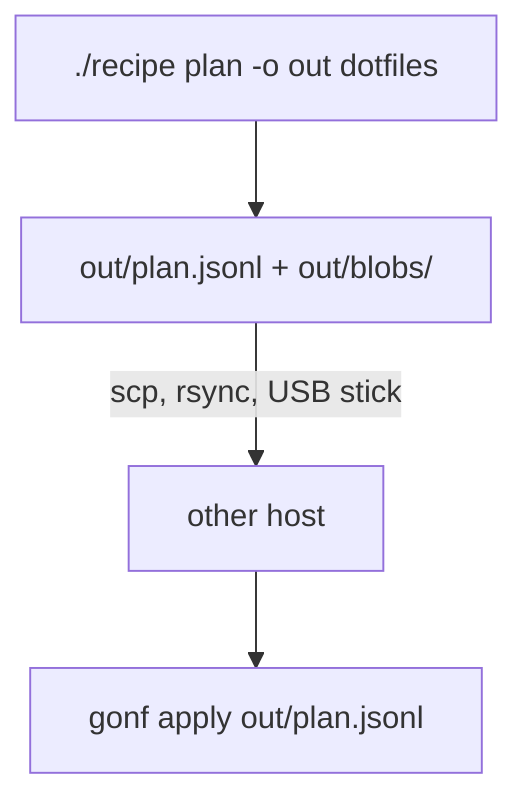

# 11. Plans

So far every run recorded a plan into a temporary directory, applied it and
threw it away. `gonf plan` keeps it: you can read it, copy it to another
machine, and apply it there with any gonf binary, no Go and no recipe
needed.

## The recipe

```go
// Command recipe records plans to apply later or elsewhere (tutorial
// chapter 11).
package main

import (
	. "github.com/snonux/gonf/api"
	"github.com/snonux/gonf/cli"
)

func main() {
	Task("dotfiles", "Shell and vim dotfiles", func() {
		base := DestHome("gonf-tutorial/plans")
		Dir(base, WithMode(0o755))
		File(base+"/bashrc", WithSource("assets/dotfiles/bashrc"), WithMode(0o644))
		Dir(base+"/vim", WithSource("assets/dotfiles/vim"), WithPrune, WithFileMode(0o644))
	}, WhenLinux())
	Task("greeting", "A small plan without blobs", func() {
		File(DestHome("gonf-tutorial/greeting"), WithContent("hi\n"), WithMode(0o644))
	})
	cli.Main()
}
```

## Write a plan

```text
$ ./recipe plan -o out dotfiles
wrote out/plan.jsonl (6 ops)
$ find out | sort
out
out/blobs
out/blobs/vim-cccecec5
out/blobs/vim-cccecec5/colors
out/blobs/vim-cccecec5/colors/tutorial.vim
out/blobs/vim-cccecec5/vimrc
out/plan.jsonl
$ cat out/plan.jsonl
{"op":"plan","version":21,"id":"plan"}
{"op":"when_begin","id":"when.dotfiles","all":[{"fact":"goos","eq":"linux"}]}
{"op":"dir","id":"Directory[${HOME}/gonf-tutorial/plans]","path":"${HOME}/gonf-tutorial/plans","mode":"0755"}
{"op":"file","id":"File[${HOME}/gonf-tutorial/plans/bashrc]","path":"${HOME}/gonf-tutorial/plans/bashrc","mode":"0644","content_b64":"IyB+Ly5iYXNocmMgbWFuYWdlZCBieSBnb25mCmV4cG9ydCBFRElUT1I9dmltCmFsaWFzIGxsPSdscyAtbCcK","has_content":true}
{"op":"sync_dir","id":"Directory[${HOME}/gonf-tutorial/plans/vim]","path":"${HOME}/gonf-tutorial/plans/vim","mode":"0750","file_mode":"0644","blob":"blobs/vim-cccecec5","source_dir":"assets/dotfiles/vim","prune":true}
{"op":"when_end"}
```

A plan directory holds:

- `plan.jsonl`: one JSON object per line. The first line is the header with
  the schema `version` the plan needs; a destination with an older gonf
  refuses it before changing anything.
- `blobs/`: large files and synced trees. Small file content travels inline
  as `content_b64`.

The `dotfiles` guard became a `when_begin`/`when_end` pair, and paths still
say `${HOME}`: the destination fills them in.



## Apply it

`gonf` here is the stand-alone binary
(`go install github.com/snonux/gonf/cmd/gonf@main`); the recipe binary has
the same `apply` subcommand.

```text
$ gonf apply -n out/plan.jsonl
2026/09/26 08:23:16 dry-run: would create directory /home/paul/gonf-tutorial/plans
2026/09/26 08:23:16 dry-run: would update /home/paul/gonf-tutorial/plans/bashrc
2026/09/26 08:23:16 dry-run: would create directory /home/paul/gonf-tutorial/plans/vim
2026/09/26 08:23:16 dry-run: would create directory /home/paul/gonf-tutorial/plans/vim/colors
2026/09/26 08:23:16 dry-run: would update /home/paul/gonf-tutorial/plans/vim/colors/tutorial.vim
2026/09/26 08:23:16 dry-run: would update /home/paul/gonf-tutorial/plans/vim/vimrc
summary: 0 ok, 0 changed, 0 skipped, 6 would-change
  would-change Directory[/home/paul/gonf-tutorial/plans]
  would-change File[/home/paul/gonf-tutorial/plans/bashrc]
  would-change Directory[/home/paul/gonf-tutorial/plans/vim]
  would-change Directory[/home/paul/gonf-tutorial/plans/vim/colors]
  would-change File[/home/paul/gonf-tutorial/plans/vim/colors/tutorial.vim]
  would-change File[/home/paul/gonf-tutorial/plans/vim/vimrc]
applied out/plan.jsonl (6 ops)
$ gonf apply out/plan.jsonl
2026/09/26 08:23:16 created directory /home/paul/gonf-tutorial/plans
2026/09/26 08:23:16 updated /home/paul/gonf-tutorial/plans/bashrc
2026/09/26 08:23:16 created directory /home/paul/gonf-tutorial/plans/vim
2026/09/26 08:23:16 created directory /home/paul/gonf-tutorial/plans/vim/colors
2026/09/26 08:23:16 updated /home/paul/gonf-tutorial/plans/vim/colors/tutorial.vim
2026/09/26 08:23:16 updated /home/paul/gonf-tutorial/plans/vim/vimrc
summary: 0 ok, 6 changed, 0 skipped, 0 would-change
  changed Directory[/home/paul/gonf-tutorial/plans]
  changed File[/home/paul/gonf-tutorial/plans/bashrc]
  changed Directory[/home/paul/gonf-tutorial/plans/vim]
  changed Directory[/home/paul/gonf-tutorial/plans/vim/colors]
  changed File[/home/paul/gonf-tutorial/plans/vim/colors/tutorial.vim]
  changed File[/home/paul/gonf-tutorial/plans/vim/vimrc]
applied out/plan.jsonl (6 ops)
$ gonf apply out/plan.jsonl
summary: 6 ok, 0 changed, 0 skipped, 0 would-change
applied out/plan.jsonl (6 ops)
```

## Plans on stdout

A plan without blobs can go through a pipe, for example into `ssh host gonf
apply -`:

```text
$ ./recipe plan -stdout dotfiles
plan: -stdout cannot emit plans that need blobs/; use -o <dir>
[exit status 1]
$ ./recipe plan -stdout greeting
{"op":"plan","version":21,"id":"plan"}
{"op":"file","id":"File[${HOME}/gonf-tutorial/greeting]","path":"${HOME}/gonf-tutorial/greeting","mode":"0644","content_b64":"aGkK","has_content":true}
wrote stdout (2 ops)
$ ./recipe plan -stdout greeting | gonf apply -
wrote stdout (2 ops)
2026/09/26 08:23:16 updated /home/paul/gonf-tutorial/greeting
summary: 0 ok, 1 changed, 0 skipped, 0 would-change
  changed File[/home/paul/gonf-tutorial/greeting]
applied stdin (2 ops)
```

For reading rather than applying, `plan -redacted` prints a preview with
secrets withheld (you saw it in earlier chapters). It is not a plan and
`gonf apply` refuses it.

| Command | Result |
|---------|--------|
| `plan -o dir tasks...` | `dir/plan.jsonl` (mode `0600`) and `dir/blobs/` |
| `plan -stdout tasks...` | JSONL on stdout, only without blobs or secrets |
| `plan -redacted tasks...` | a human preview, secrets `[redacted]` |
| `plan -o dir -seal tasks...` | an encrypted `dir/plan.age` (chapter 14) |
| `apply [-n] file` | apply a plan file, `-` for stdin |

Reference: [plan flags](../reference.md#plan-flags),
[apply flags](../reference.md#apply-flags),
[Plan format](../reference.md#plan-format).

---

← [10. Privilege](10-privilege.md) · [Contents](README.md) · Next: [12. Inventory and remote hosts](12-remote.md) →
