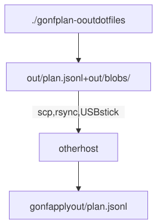

# 11. Plans

So far every run recorded a plan into a temporary directory, applied it and
threw it away. `gonf plan` keeps it: you can read it, copy it to another
machine, and apply it there with any gonf binary, no Go and no recipe
needed.

> 🦫 **Gonfy says:** A plan is my blueprint: drawn once on the controller, then followed by any gonf binary on any host.

## The recipe

```go
// Command gonf records plans to apply later or elsewhere (tutorial
// chapter 11).
package main

import (
	. "github.com/snonux/gonf/api"
	"github.com/snonux/gonf/cli"
)

func main() {
	Task("dotfiles", "Shell and vim dotfiles", func() {
		base := DestHome("gonf-tutorial/plans")
		Dir(base, WithMode(0o755))
		File(base+"/bashrc", WithSource("assets/dotfiles/bashrc"), WithMode(0o644))
		Dir(base+"/vim", WithSource("assets/dotfiles/vim"), WithPrune, WithFileMode(0o644))
	}, WhenLinux())
	Task("greeting", "A small plan without blobs", func() {
		File(DestHome("gonf-tutorial/greeting"), WithContent("hi from gonfy\n"), WithMode(0o644))
	})
	cli.Main()
}
```

## Write a plan

> 🦫 **Gonfy says:** Draw the blueprint once and keep it. The big sticks go into the blob store next to it.

```text
$ ./gonf plan -o out dotfiles
wrote out/plan.jsonl (6 ops)
$ find out | sort
out
out/blobs
out/blobs/vim-cccecec5
out/blobs/vim-cccecec5/colors
out/blobs/vim-cccecec5/colors/tutorial.vim
out/blobs/vim-cccecec5/vimrc
out/plan.jsonl
$ cat out/plan.jsonl
{"op":"plan","version":21,"id":"plan"}
{"op":"when_begin","id":"when.dotfiles","all":[{"fact":"goos","eq":"linux"}]}
{"op":"dir","id":"Directory[${HOME}/gonf-tutorial/plans]","path":"${HOME}/gonf-tutorial/plans","mode":"0755"}
{"op":"file","id":"File[${HOME}/gonf-tutorial/plans/bashrc]","path":"${HOME}/gonf-tutorial/plans/bashrc","mode":"0644","content_b64":"IyB+Ly5iYXNocmMgbWFuYWdlZCBieSBnb25mCiMgR29uZnkgc2F5czogZG90ZmlsZXMgYXJlIGxvZGdlcywga2VlcCB0aGVtIGNvbnZlcmdlZApleHBvcnQgRURJVE9SPXZpbQphbGlhcyBsbD0nbHMgLWwnCg==","has_content":true}
{"op":"sync_dir","id":"Directory[${HOME}/gonf-tutorial/plans/vim]","path":"${HOME}/gonf-tutorial/plans/vim","mode":"0750","file_mode":"0644","blob":"blobs/vim-cccecec5","source_dir":"assets/dotfiles/vim","prune":true}
{"op":"when_end"}
```

A plan directory holds:

- `plan.jsonl`: one JSON object per line (JSON Lines). The first line is
  the header. Its `version` is the plan format (schema) version the plan
  needs; a destination whose gonf only knows older versions refuses the
  plan before changing anything. `id` names the plan (`-id` sets it).
- `blobs/`: larger files (over 512 KiB) and synced trees. Smaller file
  content travels inline, base64-encoded, as `content_b64`.

`./gonf -plan-version` prints the newest schema version a gonf can apply
(27 for v0.24.2). The header above says 21 because gonf writes the lowest
version that can carry the plan, so older gonf binaries can still apply it.

The `dotfiles` guard became a `when_begin`/`when_end` pair, and paths still
say `${HOME}`: the destination fills them in.

A plan says what to change on a machine, so gonf keeps it private:
`plan.jsonl` gets mode `0600` and a new directory `0700`. It refuses an
output directory that other users can write to, such as `/tmp` itself:

```text
$ ./gonf plan -o /tmp greeting
plan: RecordPlan: plan dir: /tmp is world-writable (mode 1777); refusing to store plan output where any user can replace it: choose a private directory you own (-o <private dir>)
[exit status 1]
```

When recording fails, gonf leaves the output directory as it was.



## Apply it

> 🦫 **Gonfy says:** Any gonf binary can follow the blueprint, even one that never saw the recipe.

`gonf` without `./` is any gonf binary on the `PATH`, such as the
stand-alone one (`go install github.com/snonux/gonf/cmd/gonf@v0.24.2`) or a
copy of your own `./gonf`: every gonf binary has the same `apply`
subcommand, and applying needs no recipe.

```text
$ gonf apply -n out/plan.jsonl
2026/09/26 08:23:16 dry-run: would create directory /home/paul/gonf-tutorial/plans
2026/09/26 08:23:16 dry-run: would update /home/paul/gonf-tutorial/plans/bashrc
2026/09/26 08:23:16 dry-run: would create directory /home/paul/gonf-tutorial/plans/vim
2026/09/26 08:23:16 dry-run: would create directory /home/paul/gonf-tutorial/plans/vim/colors
2026/09/26 08:23:16 dry-run: would update /home/paul/gonf-tutorial/plans/vim/colors/tutorial.vim
2026/09/26 08:23:16 dry-run: would update /home/paul/gonf-tutorial/plans/vim/vimrc
summary: 0 ok, 0 changed, 0 skipped, 6 would-change
applied out/plan.jsonl (6 ops)
$ gonf apply out/plan.jsonl
2026/09/26 08:23:16 created directory /home/paul/gonf-tutorial/plans
2026/09/26 08:23:16 updated /home/paul/gonf-tutorial/plans/bashrc
2026/09/26 08:23:16 created directory /home/paul/gonf-tutorial/plans/vim
2026/09/26 08:23:16 created directory /home/paul/gonf-tutorial/plans/vim/colors
2026/09/26 08:23:16 updated /home/paul/gonf-tutorial/plans/vim/colors/tutorial.vim
2026/09/26 08:23:16 updated /home/paul/gonf-tutorial/plans/vim/vimrc
summary: 0 ok, 6 changed, 0 skipped, 0 would-change
applied out/plan.jsonl (6 ops)
$ gonf apply out/plan.jsonl
summary: 6 ok, 0 changed, 0 skipped, 0 would-change
applied out/plan.jsonl (6 ops)
```

## Plans on stdout

A plan without blobs can go through a pipe, for example into `ssh host gonf
apply -`:

```text
$ ./gonf plan -stdout dotfiles
plan: -stdout cannot emit plans that need blobs/; use -o <dir>
[exit status 1]
$ ./gonf plan -stdout greeting
{"op":"plan","version":21,"id":"plan"}
{"op":"file","id":"File[${HOME}/gonf-tutorial/greeting]","path":"${HOME}/gonf-tutorial/greeting","mode":"0644","content_b64":"aGkgZnJvbSBnb25meQo=","has_content":true}
wrote stdout (2 ops)
$ ./gonf plan -stdout greeting | gonf apply -
wrote stdout (2 ops)
2026/09/26 08:23:16 updated /home/paul/gonf-tutorial/greeting
summary: 0 ok, 1 changed, 0 skipped, 0 would-change
applied stdin (2 ops)
```

For reading rather than applying, `plan -redacted` prints a preview with
secrets withheld (you saw it in earlier chapters). It is not a plan and
`gonf apply` refuses it.

| Command | Result |
|---------|--------|
| `plan -o dir tasks...` | `dir/plan.jsonl` (mode `0600`) and `dir/blobs/` |
| `plan -stdout tasks...` | JSONL on stdout, only without blobs or secrets |
| `plan -redacted tasks...` | a human preview, secrets `[redacted]` |
| `plan -o dir -seal tasks...` | an encrypted `dir/plan.age` (chapter 14) |
| `apply [-n] file` | apply a plan file, `-` for stdin |

`gonf apply` runs every op of a plan file in its own process, as the user
who started it: it ignores the `elevate` marks of chapter 10. Run it with
`sudo` (or as root) for a plan with privileged ops.

Reference: [plan flags](../reference.md#plan-flags),
[apply flags](../reference.md#apply-flags),
[Plan format](../reference.md#plan-format).

---

← [10. Privilege](10-privilege.md) · [Contents](README.md) · Next: [12. Inventory and remote hosts](12-remote.md) →
