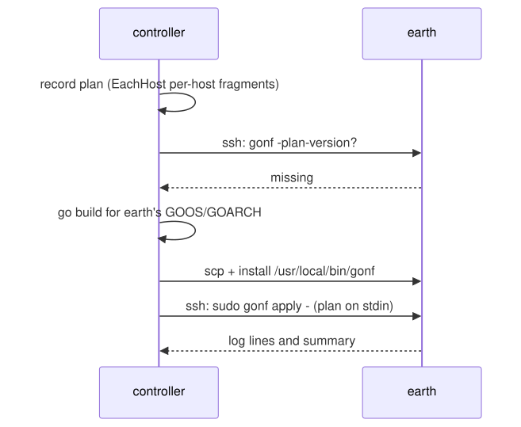

# 12. Inventory and remote hosts

Everything so far ran on one machine. Now the same recipe manages other
hosts over ssh. gonf needs nothing installed on them except an ssh login
and sudo or doas: it cross-compiles itself, copies the binary over and
installs it on the first push.

> 🦫 **Gonfy says:** Many lodges, one beaver. Name the hosts once in the inventory, then push the same recipe to one of them or to all of them.

> **About the outputs in this chapter.** They were captured with a stand-in
> for `ssh` and `scp` that ran each remote command locally under the
> target's host name, with a private `/etc/motd.d`, crontab and
> `/usr/local/bin` per host. gonf's own output is unchanged; with real hosts
> you see the same lines. When Gonfy joined the welcome message, its two
> `cat` lines were recaptured by applying `planet_motd` locally under each
> host's name.

## Hosts, clusters and fleets



```go
// Command recipe describes an inventory and pushes to it (tutorial
// chapter 12).
package main

import (
	. "github.com/snonux/gonf/api"
	"github.com/snonux/gonf/cli"
)

// Window is per-host data every planet carries: when it may run its
// maintenance job.
type Window struct{ Hour string }

// Mirror is per-host data only some planets carry: where they mirror to.
type Mirror struct{ Target string }

// Planet's tasks apply to the "inner" cluster.
type Planet struct{}

// DescMotd returns the -list description of the Motd task.
func (Planet) DescMotd() string { return "Greet with the host's name" }

// Motd writes a message of the day fragment. Destination templates see
// the destination's own facts, so every host renders its own name.
func (Planet) Motd() {
	EnsureDir("/etc/motd.d", RootOwned)
	File("/etc/motd.d/welcome", WithContent("Welcome to {{ .Gonf.Hostname }}! Gonfy waves hello.\n"), WithTemplate,
		RootOwned)
}

// DescMaintenance returns the -list description of the Maintenance task.
func (Planet) DescMaintenance() string { return "Per-host maintenance window" }

// Maintenance installs a cron job at each host's own hour.
func (Planet) Maintenance() {
	EachHost(func(w Window) {
		CronAt("maintenance", "0 "+w.Hour+" * * *", "/usr/local/bin/maintenance")
	})
}

// DescMirror returns the -list description of the Mirror task.
func (Planet) DescMirror() string { return "Mirror job, on hosts with a Mirror" }

// Mirror installs a mirror job on the hosts that have Mirror data;
// EachHostWith skips the others instead of failing.
func (Planet) Mirror() {
	EachHostWith(func(m Mirror) {
		CronAt("mirror", "30 * * * *", "rsync -a /srv/ "+m.Target+":/srv/")
	})
}

// DescEarthOnly returns the -list description of the EarthOnly task.
func (Planet) DescEarthOnly() string { return "Only on earth, within the cluster" }

// EarthOnly shows a task narrowed to part of its cluster.
func (Planet) EarthOnly() {
	File("/etc/motd.d/earth", WithContent("Mostly harmless.\n"), RootOwned)
}

// WhenEarthOnly narrows EarthOnly to earth, on top of the cluster guard.
func (Planet) WhenEarthOnly() TaskOption { return WhenHostnameIn("earth") }

func main() {
	// A bundle of defaults shared by the hosts on the LAN.
	lan := HostDefaults(WithSSHUser("paul"), WithSSHDomain("lan"),
		WithPrivilege(PrivilegeSudo), WithData(Window{Hour: "3"}))
	earth := Host("earth", lan, WithData(Mirror{Target: "mars.lan"}))
	mars := Host("mars", lan, WithData(Window{Hour: "4"}))
	pluto := Host("pluto", WithSSHUser("paul"), WithSSHHost("pluto.example.org"),
		WithPrivilege(PrivilegeSudo), WithData(Window{Hour: "5"}))

	inner := Cluster("inner", earth, mars).Parallel(2)
	outer := Cluster("outer", pluto)
	Fleet("solar", inner, outer)

	// Every Planet method binds to the inner cluster (planet_* tasks), and
	// only applies on hosts whose name contains one of its members.
	RegisterOnCluster("inner", Planet{}, Privileged())
	cli.Main()
}
```

- `Host(name, options...)` describes how to reach a host.
  `HostDefaults(...)` bundles options several hosts share; a later option
  replaces one from the bundle (mars overrides the `Window`).
- `WithSSHDomain("lan")` makes the ssh host `<name>.lan`.
- `WithData(v)` attaches a value of your own type to a host. `EachHost[T]`
  visits the cluster's hosts and hands your function each one's `T`;
  `EachHostWith[T]` skips hosts without a `T` (only earth has a `Mirror`).
- `Cluster` groups hosts, `Fleet` groups clusters.
- `RegisterOnCluster("inner", Planet{}, Privileged())` registers the
  `planet_*` tasks on the cluster, with a guard that the destination's host
  name contains `earth` or `mars`. `WhenHostnameIn("earth")` narrows one
  task further.

```text
$ ./gonf -list
planet_earth_only	Only on earth, within the cluster [destination-guarded: hostname_contains=earth|mars && hostname_contains=earth]
planet_maintenance	Per-host maintenance window [destination-guarded: hostname_contains=earth|mars]
planet_mirror	Mirror job, on hosts with a Mirror [destination-guarded: hostname_contains=earth|mars]
planet_motd	Greet with the host's name [destination-guarded: hostname_contains=earth|mars]
$ ./gonf hosts
earth	paul@earth.lan
mars	paul@mars.lan
pluto	paul@pluto.example.org
$ ./gonf clusters
inner	j=2	earth,mars
outer	j=5	pluto
$ ./gonf fleets
solar	clusters=inner,outer	hosts=earth,mars,pluto
```

## Push to one host

`push` records the plan on your machine, streams it over ssh and applies it
there. `-n` previews:

```text
$ ./gonf push -privilege=sudo -n paul@earth.lan planet_motd planet_maintenance
2026/09/26 08:23:17 push paul@earth.lan: remote plan schema 0 < 27 — syncing gonf binary
2026/09/26 08:23:19 push paul@earth.lan: remote gonf plan schema now 27
2026/09/26 08:23:19 dry-run: would update /etc/motd.d/welcome
2026/09/26 08:23:19 dry-run: would update crontab for root (job maintenance)
summary: 1 ok, 0 changed, 0 skipped, 2 would-change
  would-change File[/etc/motd.d/welcome]
  would-change Cron[root/maintenance]
applied stdin (10 ops)
pushed push (10 ops) to paul@earth.lan
$ ./gonf push -privilege=sudo paul@earth.lan planet_motd planet_maintenance
2026/09/26 08:23:20 updated /etc/motd.d/welcome
2026/09/26 08:23:20 updated crontab for root (job maintenance)
summary: 1 ok, 2 changed, 0 skipped, 0 would-change
  changed File[/etc/motd.d/welcome]
  changed Cron[root/maintenance]
applied stdin (10 ops)
pushed push (10 ops) to paul@earth.lan
$ ssh paul@earth.lan cat /etc/motd.d/welcome
Welcome to earth! Gonfy waves hello.
$ ssh paul@earth.lan sudo crontab -l
# BEGIN GONF Cron[maintenance]
0 3 * * * /usr/local/bin/maintenance
# END GONF Cron[maintenance]
```

The first push found no gonf on earth, built one for its platform and
installed it (`syncing gonf binary`). The template rendered earth's own
host name, and `EachHost` gave earth its own hour.



## Push to a cluster

`cluster` records once and pushes to every member, `-j` hosts at a time
(the cluster's `.Parallel(2)` by default; `-j 1` keeps the output in order
here):

```text
$ ./gonf cluster -n -j 1 inner planet_motd planet_maintenance
summary: 3 ok, 0 changed, 0 skipped, 0 would-change
applied stdin (13 ops)
2026/09/26 08:23:20 push paul@mars.lan: remote plan schema 0 < 27 — syncing gonf binary
2026/09/26 08:23:20 push paul@mars.lan: remote gonf plan schema now 27
2026/09/26 08:23:20 dry-run: would update /etc/motd.d/welcome
2026/09/26 08:23:20 dry-run: would update crontab for root (job maintenance)
summary: 1 ok, 0 changed, 0 skipped, 2 would-change
  would-change File[/etc/motd.d/welcome]
  would-change Cron[root/maintenance]
applied stdin (13 ops)
pushed cluster-inner (13 ops) to inner (2/2 hosts)
$ ./gonf cluster -j 1 inner planet_motd planet_maintenance
summary: 3 ok, 0 changed, 0 skipped, 0 would-change
applied stdin (13 ops)
2026/09/26 08:23:20 updated /etc/motd.d/welcome
2026/09/26 08:23:20 updated crontab for root (job maintenance)
summary: 1 ok, 2 changed, 0 skipped, 0 would-change
  changed File[/etc/motd.d/welcome]
  changed Cron[root/maintenance]
applied stdin (13 ops)
pushed cluster-inner (13 ops) to inner (2/2 hosts)
$ ssh paul@mars.lan cat /etc/motd.d/welcome
Welcome to mars! Gonfy waves hello.
$ ssh paul@mars.lan sudo crontab -l
# BEGIN GONF Cron[maintenance]
0 4 * * * /usr/local/bin/maintenance
# END GONF Cron[maintenance]
```

The optional data and the narrowed task:

```text
$ ./gonf cluster -j 1 inner planet_mirror planet_earth_only
2026/09/26 08:23:21 updated crontab for root (job mirror)
2026/09/26 08:23:21 updated /etc/motd.d/earth
summary: 0 ok, 2 changed, 0 skipped, 0 would-change
  changed Cron[root/mirror]
  changed File[/etc/motd.d/earth]
applied stdin (9 ops)
summary: 0 ok, 0 changed, 0 skipped, 0 would-change
applied stdin (9 ops)
pushed cluster-inner (9 ops) to inner (2/2 hosts)
$ ssh paul@earth.lan sudo crontab -l
# BEGIN GONF Cron[maintenance]
0 3 * * * /usr/local/bin/maintenance
# END GONF Cron[maintenance]
# BEGIN GONF Cron[mirror]
30 * * * * rsync -a /srv/ mars.lan:/srv/
# END GONF Cron[mirror]
$ ssh paul@mars.lan ls /etc/motd.d
welcome
```

On mars, `EachHostWith` left out the mirror job and `WhenHostnameIn` left
out the `earth` fragment.

## Strict preview and fleets

`-preview` is a dry run that never installs or upgrades anything on the
host. `fleet` pushes to every cluster of a fleet:

```text
$ ./gonf push -privilege=sudo -preview paul@mars.lan planet_motd
summary: 2 ok, 0 changed, 0 skipped, 0 would-change
previewed stdin (5 ops)
previewed push (5 ops) on paul@mars.lan
$ ./gonf fleet -n -j 1 solar planet_motd
2026/09/26 08:23:21 push paul@pluto.example.org: remote plan schema 0 < 27 — syncing gonf binary
summary: 2 ok, 0 changed, 0 skipped, 0 would-change
applied stdin (5 ops)
summary: 2 ok, 0 changed, 0 skipped, 0 would-change
applied stdin (5 ops)
pushed fleet-solar (5 ops) to inner (2/2 hosts)
2026/09/26 08:23:21 push paul@pluto.example.org: remote gonf plan schema now 27
summary: 0 ok, 0 changed, 0 skipped, 0 would-change
applied stdin (5 ops)
pushed fleet-solar (5 ops) to outer (1/1 hosts)
```

pluto is in the fleet but not in `inner`, so the `planet_motd` guard skipped
everything there: `0 ok, 0 changed`.

## What the plan carries

Per-host fragments become `when_begin` blocks on the host name, inside the
task's own cluster guard:

```text
$ ./gonf plan -redacted planet_maintenance planet_earth_only
{"op":"plan_preview","version":21,"id":"plan"}
{"op":"when_begin","id":"when.planet_maintenance","elevate":true,"all":[{"fact":"hostname_contains","in":["earth","mars"]}]}
{"op":"when_begin","id":"when.hostname:earth","all":[{"fact":"hostname_contains","eq":"earth"}]}
{"op":"cron","id":"Cron[root/maintenance]","name":"maintenance","cron_user":"root","command":"/usr/local/bin/maintenance","schedule":"0 3 * * *","elevate":true}
{"op":"when_end"}
{"op":"when_begin","id":"when.hostname:mars","all":[{"fact":"hostname_contains","eq":"mars"}]}
{"op":"cron","id":"Cron[root/maintenance]","name":"maintenance","cron_user":"root","command":"/usr/local/bin/maintenance","schedule":"0 4 * * *","elevate":true}
{"op":"when_end"}
{"op":"when_end","elevate":true}
{"op":"when_begin","id":"when.planet_earth_only","elevate":true,"all":[{"fact":"hostname_contains","in":["earth","mars"]},{"fact":"hostname_contains","eq":"earth"}]}
{"op":"file","id":"File[/etc/motd.d/earth]","path":"/etc/motd.d/earth","mode":"0644","owner":"root","group":"0","content_b64":"TW9zdGx5IGhhcm1sZXNzLgo=","has_content":true,"elevate":true}
{"op":"when_end","elevate":true}
wrote redacted preview to stdout (12 ops, 0 secret-bearing; not a plan, cannot be applied)
```

| Command | What it does |
|---------|--------------|
| `push [-n\|-preview] [-privilege m] user@host tasks...` | one host, privilege from the flag |
| `cluster [-n\|-preview] [-j N] name tasks...` | every host of a cluster, privilege from the inventory |
| `fleet [-n\|-preview] [-j N] name tasks...` | every host of a fleet |
| `hosts`, `clusters`, `fleets` | list the inventory |

A failing host cancels the others; `-host-timeout` (default 10m) bounds
each host. If your inventory names are not part of the machines' host
names, set `WithHostnameMatch` on the host.

Reference: [Inventory](../reference.md#inventory),
[Host defaults](../reference.md#host-defaults),
[Per-host fragments](../reference.md#per-host-fragments),
[RegisterMethods](../reference.md#registermethods) (`RegisterOnCluster`,
`WhenHostnameIn`), [Remote binary sync](../reference.md#remote-binary-sync),
[Timeouts and cancellation](../reference.md#timeouts-and-cancellation).

---

← [11. Plans](11-plans.md) · [Contents](README.md) · Next: [13. Secrets](13-secrets.md) →
