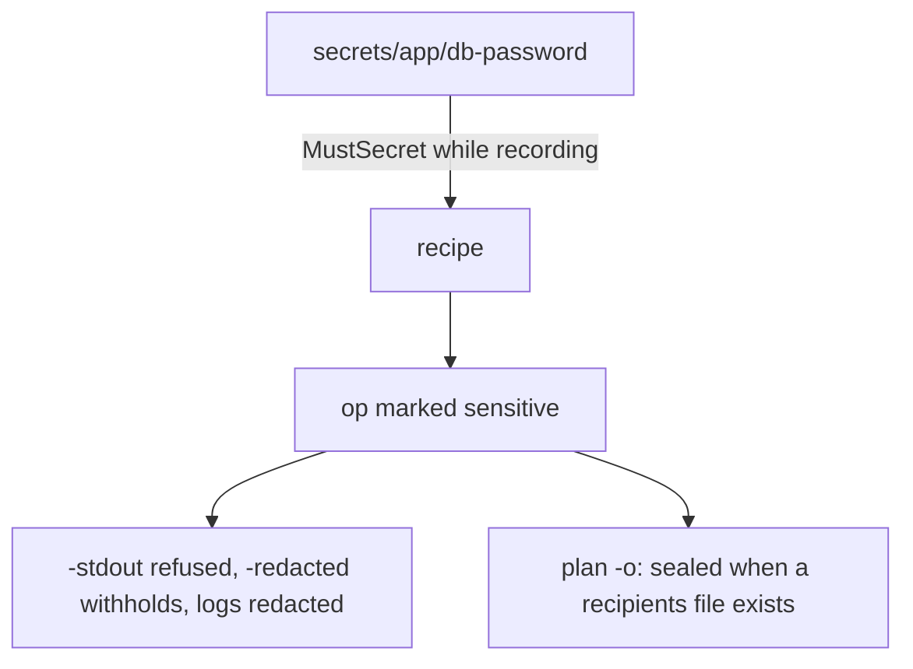

# 13. Secrets

Passwords and tokens should not live in your recipe's source. gonf resolves
them from a secret provider while recording, notices where they end up in
the plan, and keeps them out of logs and previews.

## Where secrets come from

The default provider reads `secrets/<ref>` below the directory you run the
recipe from. The chapter's recipe directory has two:

```text
$ find secrets -type f
secrets/app/api-token
secrets/app/db-password
```

(Keep `secrets/` out of version control in a real recipe. The tutorial
checks in two fake ones so the example runs.) Other providers, such as the
`foostore` KeePass provider or your own `secret.ProviderFunc`, plug in with
`SetSecretProvider`.

## The recipe

```go
// Command recipe uses secrets (tutorial chapter 13).
package main

import (
	. "github.com/snonux/gonf/api"
	"github.com/snonux/gonf/cli"
)

func main() {
	Task("app", "App config with a database password", func() {
		dir := DestHome("gonf-tutorial/secrets")
		Dir(dir, WithMode(0o700))

		// A file that is exactly one secret: secrets/app/api-token.
		SecretFile(dir+"/api-token", "app/api-token")

		// A secret inside other content. The op is marked sensitive
		// automatically, because its content contains the resolved value.
		password := MustSecret("app/db-password")
		File(dir+"/app.conf",
			WithContent("db_user=app\ndb_password="+password+"\n"), WithMode(0o600))

		// An optional secret: only configure SMTP when one exists.
		if smtp, ok := OptionalSecret("app/smtp-password"); ok {
			File(dir+"/smtp.conf", WithContent("password="+smtp+"\n"), WithMode(0o600))
		}
	})
	cli.Main()
}
```

| Call | Behaviour |
|------|-----------|
| `SecretFile(path, ref)` | a file that is exactly the secret, mode `0600` by default |
| `MustSecret(ref)` | the value; a missing secret fails the record |
| `OptionalSecret(ref)` | `("", false)` when the secret does not exist |

## Run it

Run it from the recipe's directory, so `secrets/` is found:

```text
$ ./recipe app
2026/09/26 08:23:22 created directory /home/paul/gonf-tutorial/secrets
2026/09/26 08:23:22 updated /home/paul/gonf-tutorial/secrets/api-token
2026/09/26 08:23:22 updated /home/paul/gonf-tutorial/secrets/app.conf
summary: 0 ok, 3 changed, 0 skipped, 0 would-change
  changed Directory[/home/paul/gonf-tutorial/secrets]
  changed File[/home/paul/gonf-tutorial/secrets/api-token]
  changed File[/home/paul/gonf-tutorial/secrets/app.conf]
$ cat /home/paul/gonf-tutorial/secrets/app.conf
db_user=app
db_password=correct-horse-battery
```

## Sensitive ops

gonf remembers every resolved value and scans the recorded plan for it.
Ops that contain one are marked sensitive, and that changes how plans are
written:

```text
$ ./recipe plan -stdout app
plan: -stdout refused: the plan carries secret material in File[${HOME}/gonf-tutorial/secrets/api-token], File[${HOME}/gonf-tutorial/secrets/app.conf]; use -o <dir> (plan.jsonl is written 0600), -redacted for a human preview, or -stdout -with-secrets to print it anyway
[exit status 1]
$ ./recipe plan -redacted app
{"op":"plan_preview","version":22,"id":"plan"}
{"op":"dir","id":"Directory[${HOME}/gonf-tutorial/secrets]","path":"${HOME}/gonf-tutorial/secrets","mode":"0700"}
{"op":"file","id":"File[${HOME}/gonf-tutorial/secrets/api-token]","path":"${HOME}/gonf-tutorial/secrets/api-token","mode":"0600","content_b64":"[redacted]","has_content":true,"sensitive":true}
{"op":"file","id":"File[${HOME}/gonf-tutorial/secrets/app.conf]","path":"${HOME}/gonf-tutorial/secrets/app.conf","mode":"0600","content_b64":"[redacted]","has_content":true,"sensitive":true}
wrote redacted preview to stdout (4 ops, 2 secret-bearing; not a plan, cannot be applied)
$ ./recipe plan -o out app
wrote out/plan.jsonl (4 ops)
plan: out/plan.jsonl carries secret material in clear text (File[${HOME}/gonf-tutorial/secrets/api-token], File[${HOME}/gonf-tutorial/secrets/app.conf]); it is an executable secret artifact (mode 0600, base64 is not encryption): delete it once applied
$ ls -l out
total 4
-rw------- 1 root root 605 Sep 26 08:23 plan.jsonl
```

- `plan -stdout` refuses a plan with secrets (override with `-with-secrets`).
- `plan -redacted` withholds the content of sensitive ops.
- `plan -o` writes `plan.jsonl` with mode `0600` and warns: base64 is not
  encryption. Chapter 14 encrypts it instead.
- Log lines, errors and push output are redacted against resolved values.

A missing secret stops the record before anything is applied:

```text
$ mv secrets/app/db-password /tmp/
$ ./recipe app
error: secret "app/db-password" is missing
error: declared at /home/paul/gonf/docs/tutorial/examples/ch13-secrets/main.go:20
[exit status 1]
```



Keep secrets out of resource names: an unnamed `Command` whose argv holds a
secret is refused, so give it `WithName`.

Reference: [Secrets](../reference.md#secrets),
[Providers](../reference.md#providers),
[Sensitive ops](../reference.md#sensitive-ops),
[SecretFile](../reference.md#secretfile).

---

← [12. Inventory and remote hosts](12-remote.md) · [Contents](README.md) · Next: [14. Sealed and signed plans](14-sealed-signed.md) →
