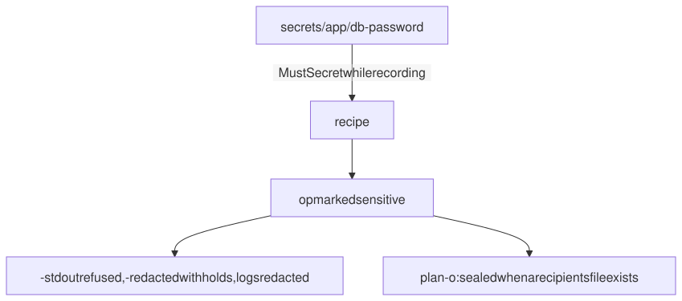

# 13. Secrets

Passwords and tokens should not live in your recipe's source. gonf resolves
them from a secret provider while recording, notices where they end up in
the plan, and keeps them out of logs and previews.

> 🦫 **Gonfy says:** Secrets stay in my cheek pouch until the moment they are needed. gonf marks every op that carries one as sensitive.

## Where secrets come from

> 🦫 **Gonfy says:** Secrets come from a provider on the controller. They never sit in the recipe itself.

The default provider reads `secrets/<ref>` below the directory you run the
recipe from. The chapter's recipe directory has two:

```text
$ find secrets -type f
secrets/app/api-token
secrets/app/db-password
```

(Keep `secrets/` out of version control in a real recipe. The tutorial
checks in two fake ones so the example runs.)

Other providers, such as the `foostore` KeePass provider or your own
`secret.ProviderFunc`, plug in with `SetSecretProvider` in `main`. Wrap
such a provider in `secret.NewSnapshot(...)` so each secret is fetched only
once per run. To move from files to a store one secret at a time,
`secret.NewFallback(store, secret.FileProvider{})` asks the store first and
falls back to the file.

## The recipe

```go
// Command gonf uses secrets (tutorial chapter 13).
package main

import (
	. "github.com/snonux/gonf/api"
	"github.com/snonux/gonf/cli"
)

func main() {
	Task("app", "App config with a database password", func() {
		dir := DestHome("gonf-tutorial/secrets")
		Dir(dir, WithMode(0o700))

		// A file that is exactly one secret: secrets/app/api-token.
		SecretFile(dir+"/api-token", "app/api-token")

		// A secret inside other content. The op is marked sensitive
		// automatically, because its content contains the resolved value.
		password := MustSecret("app/db-password")
		File(dir+"/app.conf",
			WithContent("db_user=app\ndb_password="+password+"\n"), WithMode(0o600))

		// An optional secret: only configure SMTP when one exists.
		if smtp, ok := OptionalSecret("app/smtp-password"); ok {
			File(dir+"/smtp.conf", WithContent("password="+smtp+"\n"), WithMode(0o600))
		}
	})
	cli.Main()
}
```

| Call | Behaviour |
|------|-----------|
| `SecretFile(path, ref)` | a file that is exactly the secret, mode `0600` by default |
| `MustSecret(ref)` | the value; a missing secret fails the record |
| `OptionalSecret(ref)` | `("", false)` when the secret does not exist |

`OptionalSecret` forgives only a missing secret: any other failure, such as
a missing `secrets/` directory, still fails the record. For Go code outside
a task body, such as a start-up check, `ResolveSecret(ctx, ref)` returns
the value and an error instead; test the error with
`secret.IsNotFound(err)`. gonf protects its value like the others (see
[Sensitive ops](#sensitive-ops) below).

## Run it

Run it from the recipe's directory, so `secrets/` is found:

```text
$ ./gonf app
2026/09/26 08:23:22 created directory /home/paul/gonf-tutorial/secrets
2026/09/26 08:23:22 updated /home/paul/gonf-tutorial/secrets/api-token
2026/09/26 08:23:22 updated /home/paul/gonf-tutorial/secrets/app.conf
summary: 0 ok, 3 changed, 0 skipped, 0 would-change
$ cat /home/paul/gonf-tutorial/secrets/app.conf
db_user=app
db_password=correct-horse-battery
```

## Sensitive ops

> 🦫 **Gonfy says:** An op that carries a secret is marked sensitive, and a redacted preview hides it from prying eyes.

gonf remembers every resolved value and scans the recorded plan for it.
Ops that contain one are marked sensitive, and that changes how plans are
written:

```text
$ ./gonf plan -stdout app
plan: -stdout refused: the plan carries secret material in File[${HOME}/gonf-tutorial/secrets/api-token], File[${HOME}/gonf-tutorial/secrets/app.conf]; use -o <dir> (plan.jsonl is written 0600), -redacted for a human preview, or -stdout -with-secrets to print it anyway
[exit status 1]
$ ./gonf plan -redacted app
{"op":"plan_preview","version":22,"id":"plan"}
{"op":"dir","id":"Directory[${HOME}/gonf-tutorial/secrets]","path":"${HOME}/gonf-tutorial/secrets","mode":"0700"}
{"op":"file","id":"File[${HOME}/gonf-tutorial/secrets/api-token]","path":"${HOME}/gonf-tutorial/secrets/api-token","mode":"0600","content_b64":"[redacted]","has_content":true,"sensitive":true}
{"op":"file","id":"File[${HOME}/gonf-tutorial/secrets/app.conf]","path":"${HOME}/gonf-tutorial/secrets/app.conf","mode":"0600","content_b64":"[redacted]","has_content":true,"sensitive":true}
wrote redacted preview to stdout (4 ops, 2 secret-bearing; not a plan, cannot be applied)
$ ./gonf plan -o out app
wrote out/plan.jsonl (4 ops)
plan: out/plan.jsonl carries secret material in clear text (File[${HOME}/gonf-tutorial/secrets/api-token], File[${HOME}/gonf-tutorial/secrets/app.conf]); it is an executable secret artifact (mode 0600, base64 is not encryption): delete it once applied
$ ls -l out
total 4
-rw------- 1 root root 605 Sep 26 08:23 plan.jsonl
```

- `plan -stdout` refuses a plan with secrets. `plan -stdout -with-secrets`
  prints it anyway, for a pipe such as `| ssh host gonf apply -`.
- `plan -redacted` withholds the content of sensitive ops.
- `plan -o` writes `plan.jsonl` with mode `0600` and warns: base64 is not
  encryption. Chapter 14 encrypts it instead.
- Log lines, errors and push output are redacted against resolved values.
- gonf finds a secret only as it was resolved. If you transform it (base64,
  a hash, part of it) or sync it in a directory tree, mark the resource
  with `WithSensitive` yourself.

A missing secret stops the record before anything is applied:

```text
$ mv secrets/app/db-password /tmp/
$ ./gonf app
error: secret "app/db-password" is missing
error: declared at /home/paul/gonf/docs/tutorial/examples/ch13-secrets/main.go:20
[exit status 1]
```



Keep secrets out of resource names: an unnamed `Command` whose argv holds a
secret is refused, so give it `WithName`.

Reference: [Secrets](../reference.md#secrets),
[Providers](../reference.md#providers),
[Sensitive ops](../reference.md#sensitive-ops),
[SecretFile](../reference.md#secretfile).

---

← [12. Inventory and remote hosts](12-remote.md) · [Contents](README.md) · Next: [14. Sealed and signed plans](14-sealed-signed.md) →
