# 14. Sealed and signed plans

A plan with secrets is a secret itself. gonf can encrypt it with
[age](https://age-encryption.org) (post-quantum recipients only), so it is
safe to copy around, and sign it, so a host applies only plans you made.
This chapter reuses the recipe from [chapter 13](13-secrets.md), run from
`examples/ch13-secrets`.

> 🦫 **Gonfy says:** Seal the blueprint so only the right lodge can read it, and sign it so the lodge knows it came from me.

## Keys

Sealing needs an age identity with a post-quantum key (`age-keygen -pq`,
age 1.3 or newer). Its public half goes into the recipients file:

```text
$ age-keygen -pq -o ~/.config/gonf/identity
Public key: age1pq1gfp82822jjmq9xqs…
$ age-keygen -y ~/.config/gonf/identity >> ~/.config/gonf/recipients
$ ls -l /home/paul/.config/gonf
total 8
-rw------- 1 root root 2084 Sep 26 08:23 identity
-rw-r--r-- 1 root root 1960 Sep 26 08:23 recipients
```

(Public keys are about 2000 characters; they are shortened here.)

## Sealed by default

With a recipients file in place, `plan -o` of a plan with secrets writes an
encrypted `plan.age` instead of `plan.jsonl`:

```text
$ ./gonf plan -o out app
wrote out/plan.age (4 ops, 1 recipients)
  recipient age1pq1…fcse0wl4 sha256:df690bc75e349537
plan: sealed by default: the plan carries secret material in File[${HOME}/gonf-tutorial/secrets/api-token], File[${HOME}/gonf-tutorial/secrets/app.conf] and the recipients file /home/paul/.config/gonf/recipients exists, so out/plan.age was written instead of a plaintext plan.jsonl; decrypt it with gonf apply -identity <file>, or pass -plaintext to write plaintext instead
$ ls -l out
total 4
-rw------- 1 root root 1976 Sep 26 08:23 plan.age
$ head -c 64 out/plan.age
age-encryption.org/v1
-> mlkem768x25519 jVNC3LxjNeIimKqayOqDa9Ch
$ gonf apply -identity /home/paul/.config/gonf/identity out/plan.age
2026/09/26 08:23:23 created directory /home/paul/gonf-tutorial/secrets
2026/09/26 08:23:23 updated /home/paul/gonf-tutorial/secrets/api-token
2026/09/26 08:23:23 updated /home/paul/gonf-tutorial/secrets/app.conf
summary: 0 ok, 3 changed, 0 skipped, 0 would-change
  changed Directory[/home/paul/gonf-tutorial/secrets]
  changed File[/home/paul/gonf-tutorial/secrets/api-token]
  changed File[/home/paul/gonf-tutorial/secrets/app.conf]
decrypted and applied out/plan.age (4 ops)
```

Nothing but the age header is readable. `gonf apply -identity` decrypts in
memory and applies. As a normal user the default identity path
(`~/.config/gonf/identity`) is used; as root, pass `-identity` explicitly.
`-seal` forces sealing for any plan, and `-plaintext` opts out.

## Signing

A sealed plan proves nothing about who made it, because recipients are
public. Signing adds that. Create a signer key; its public line goes into
each destination's `trusted-signers` file:

```text
$ gonf plan-signer-keygen ~/.config/gonf/signer >> ~/.config/gonf/trusted-signers
wrote signer secret key /home/paul/.config/gonf/signer (mode 0600; keep it private)
  signer gonf-signer-ed25519 gZtuqeESJ+fbncDh2+s0vUuhOAj2AsutBXaZUy6TUdA sha256:3823f1059a5a8135
add the line below to each destination's trusted-signers file:
$ cat /home/paul/.config/gonf/trusted-signers
gonf-signer-ed25519 gZtuqeESJ+fbncDh2+s0vUuhOAj2AsutBXaZUy6TUdA
$ ./gonf plan -o out -seal -sign /home/paul/.config/gonf/signer app
wrote out/plan.age (4 ops, 1 recipients, signed 2026-09-26T08:23:23Z)
  recipient age1pq1…fcse0wl4 sha256:df690bc75e349537
  signer gonf-signer-ed25519 gZtuqeESJ+fbncDh2+s0vUuhOAj2AsutBXaZUy6TUdA sha256:3823f1059a5a8135
$ head -4 out/plan.age
GONF-SIGNED-PLAN/1
gZtuqeESJ+fbncDh2+s0vUuhOAj2AsutBXaZUy6TUdA
a6dZxMUKvQf13MTP5P5pRznwHiPj+gsw35MSmuLl55xWrGTQeTyr0LqrHLj7VftVIFgV+Wqwql6MpGtHyw2lBg
signed-at 2026-09-26T08:23:23Z
```

The envelope carries the signer's key, the signature, the signing time and
then the sealed plan. Apply it with `-require-signed`, and anything else is
refused:

```text
$ gonf apply -identity /home/paul/.config/gonf/identity -trusted-signers /home/paul/.config/gonf/trusted-signers -require-signed out/plan.age
apply: out/plan.age: signature verified: trusted signer gonf-signer-ed25519 gZtuqeESJ+fbncDh2+s0vUuhOAj2AsutBXaZUy6TUdA sha256:3823f1059a5a8135, signed 2026-09-26T08:23:23Z (within -max-signed-age 24h0m0s)
summary: 3 ok, 0 changed, 0 skipped, 0 would-change
decrypted and applied out/plan.age (4 ops)
$ ./gonf plan -o plain -plaintext app
wrote plain/plan.jsonl (4 ops)
plan: plain/plan.jsonl carries secret material in clear text (File[${HOME}/gonf-tutorial/secrets/api-token], File[${HOME}/gonf-tutorial/secrets/app.conf]); it is an executable secret artifact (mode 0600, base64 is not encryption): delete it once applied
$ gonf apply -identity /home/paul/.config/gonf/identity -trusted-signers /home/paul/.config/gonf/trusted-signers -require-signed plain/plan.jsonl
apply: -require-signed: plain/plan.jsonl is a plaintext plan (plan.jsonl, push frame or bare JSONL), not a GONF-SIGNED-PLAN/1 envelope; nothing applied
[exit status 1]
```

`plan-verify` checks the signature without decrypting, for a pipeline of
separate tools:

```text
$ gonf plan-verify -trusted-signers ~/.config/gonf/trusted-signers out/plan.age | age -d -i ~/.config/gonf/identity | gonf apply -n -
plan-verify: out/plan.age: signature verified: trusted signer gonf-signer-ed25519 gZtuqeESJ+fbncDh2+s0vUuhOAj2AsutBXaZUy6TUdA sha256:3823f1059a5a8135, signed 2026-09-26T08:23:23Z (within -max-signed-age 24h0m0s); wrote its plan.age to stdout (1976 bytes, still sealed, nothing decrypted)
summary: 3 ok, 0 changed, 0 skipped, 0 would-change
applied stdin (4 ops)
```



## One artifact per host

`plan -seal -for <host|cluster|fleet>` writes one `plan-<host>.age` per host,
sealed to that host's own key (`WithPlanRecipient` in the inventory) plus
yours, so each host can decrypt only its own plan.

Reference: [Sealed plans](../reference.md#sealed-plans),
[Per-host artifacts](../reference.md#per-host-artifacts--for),
[Signed plans](../reference.md#signed-plans).

---

← [13. Secrets](13-secrets.md) · [Contents](README.md) · Next: [15. When things go wrong](15-troubleshooting.md) →
