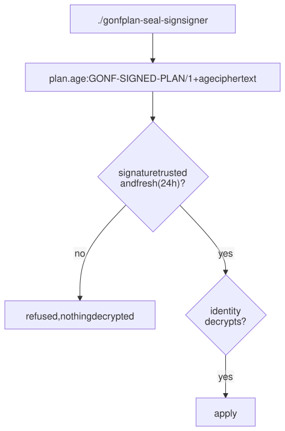

# 14. Sealed and signed plans

A plan with secrets is a secret itself. gonf can encrypt it with
[age](https://age-encryption.org) (post-quantum recipients only), so it is
safe to copy around, and sign it, so a host applies only plans you made.
Most of this chapter reuses the recipe from [chapter 13](13-secrets.md),
run from `examples/ch13-secrets`.

> 🦫 **Gonfy says:** Seal the blueprint so only the right lodge can read it, and sign it so the lodge knows it came from me.

## Keys

> 🦫 **Gonfy says:** A key for opening the blueprint and a key for signing it. Keep both somewhere safe.

Sealing needs an age identity, a private key file, with a post-quantum
key (`age-keygen -pq`, age 1.3 or newer). Its public half, the recipient,
goes into the recipients file:

```text
$ mkdir -p ~/.config/gonf
$ age-keygen -pq -o ~/.config/gonf/identity
Public key: age1pq1yefncghk0xytvn8…
$ age-keygen -y ~/.config/gonf/identity >> ~/.config/gonf/recipients
$ ls -l /home/paul/.config/gonf
total 8
-rw------- 1 root root 2084 Sep 30 04:26 identity
-rw-r--r-- 1 root root 1960 Sep 30 04:26 recipients
```

(Public keys are about 2000 characters; they are shortened here.)

## Sealed by default

With a recipients file in place, `plan -o` of a plan with secrets writes an
encrypted `plan.age` instead of `plan.jsonl`:

```text
$ ./gonf plan -o out app
wrote out/plan.age (4 ops, 1 recipients)
  recipient age1pq1…gcwgx408 sha256:728288ccaafad912
plan: sealed by default: the plan carries secret material in File[${HOME}/gonf-tutorial/secrets/api-token], File[${HOME}/gonf-tutorial/secrets/app.conf] and the recipients file /home/paul/.config/gonf/recipients exists, so out/plan.age was written instead of a plaintext plan.jsonl; decrypt it with gonf apply -identity <file>, or pass -plaintext to write plaintext instead
$ ls -l out
total 4
-rw------- 1 root root 1976 Sep 30 04:26 plan.age
$ head -c 64 out/plan.age
age-encryption.org/v1
-> mlkem768x25519 QZ6hfyrsDpOW30LY/SmbTFeQ
$ gonf apply -identity /home/paul/.config/gonf/identity out/plan.age
2026/09/30 04:26:09 created directory /home/paul/gonf-tutorial/secrets
2026/09/30 04:26:09 updated /home/paul/gonf-tutorial/secrets/api-token
2026/09/30 04:26:09 updated /home/paul/gonf-tutorial/secrets/app.conf
summary: 0 ok, 3 changed, 0 skipped, 0 would-change
decrypted and applied out/plan.age (4 ops)
```

Nothing but the age header is readable. `gonf apply -identity` decrypts in
memory and applies. As a normal user the default identity path
(`~/.config/gonf/identity`) is used; as root, pass `-identity` explicitly.
`-seal` forces sealing for any plan, and `-plaintext` opts out. With
`-stdout`, a sealed plan goes through a pipe:
`./gonf plan -seal -stdout app | ssh host sudo gonf apply -identity /etc/gonf/identity -`.

## Signing

> 🦫 **Gonfy says:** My paw print tells the lodge who drew the blueprint.

A sealed plan proves nothing about who made it, because recipients are
public. Signing adds that. Create a signer key; its public line goes into
each destination's `trusted-signers` file:

```text
$ gonf plan-signer-keygen ~/.config/gonf/signer >> ~/.config/gonf/trusted-signers
wrote signer secret key /home/paul/.config/gonf/signer (mode 0600; keep it private)
  signer gonf-signer-ed25519 sV7VUTiw1zaOfPB7bsxLcmwdcg37R9xRRMqG+MkNGNU sha256:1eaa0c02a6974db0
add the line below to each destination's trusted-signers file:
$ cat /home/paul/.config/gonf/trusted-signers
gonf-signer-ed25519 sV7VUTiw1zaOfPB7bsxLcmwdcg37R9xRRMqG+MkNGNU
$ ./gonf plan -o out -seal -sign /home/paul/.config/gonf/signer app
wrote out/plan.age (4 ops, 1 recipients, signed 2026-09-30T04:26:09Z)
  recipient age1pq1…gcwgx408 sha256:728288ccaafad912
  signer gonf-signer-ed25519 sV7VUTiw1zaOfPB7bsxLcmwdcg37R9xRRMqG+MkNGNU sha256:1eaa0c02a6974db0
$ head -4 out/plan.age
GONF-SIGNED-PLAN/1
sV7VUTiw1zaOfPB7bsxLcmwdcg37R9xRRMqG+MkNGNU
ykG0dETrePs8SZ2It4Me1QfGIPZZa2x3pM9Cys+jzSfgYLAVqF1c4eF3znyxHt9VybvojbKjQCRw9G4ex7hGDg
signed-at 2026-09-30T04:26:09Z
```

The envelope carries the signer's key, the signature, the signing time and
then the sealed plan. gonf checks the signature before it decrypts
anything, and refuses a plan signed more than `-max-signed-age` ago
(default 24 hours), so a captured plan cannot be replayed long after you
made it. With `-require-signed`, `gonf apply` refuses anything that is not
signed by a trusted signer:

```text
$ gonf apply -identity /home/paul/.config/gonf/identity -trusted-signers /home/paul/.config/gonf/trusted-signers -require-signed out/plan.age
apply: out/plan.age: signature verified: trusted signer gonf-signer-ed25519 sV7VUTiw1zaOfPB7bsxLcmwdcg37R9xRRMqG+MkNGNU sha256:1eaa0c02a6974db0, signed 2026-09-30T04:26:09Z (within -max-signed-age 24h0m0s)
summary: 3 ok, 0 changed, 0 skipped, 0 would-change
decrypted and applied out/plan.age (4 ops)
$ ./gonf plan -o plain -plaintext app
wrote plain/plan.jsonl (4 ops)
plan: plain/plan.jsonl carries secret material in clear text (File[${HOME}/gonf-tutorial/secrets/api-token], File[${HOME}/gonf-tutorial/secrets/app.conf]); it is an executable secret artifact (mode 0600, base64 is not encryption): delete it once applied
$ gonf apply -identity /home/paul/.config/gonf/identity -trusted-signers /home/paul/.config/gonf/trusted-signers -require-signed plain/plan.jsonl
apply: -require-signed: plain/plan.jsonl is a plaintext plan (plan.jsonl, push frame or bare JSONL), not a GONF-SIGNED-PLAN/1 envelope; nothing applied
[exit status 1]
```

`plan-verify` checks the signature without decrypting, for a pipeline of
separate tools:

```text
$ gonf plan-verify -trusted-signers ~/.config/gonf/trusted-signers out/plan.age | age -d -i ~/.config/gonf/identity | gonf apply -n -
plan-verify: out/plan.age: signature verified: trusted signer gonf-signer-ed25519 sV7VUTiw1zaOfPB7bsxLcmwdcg37R9xRRMqG+MkNGNU sha256:1eaa0c02a6974db0, signed 2026-09-30T04:26:09Z (within -max-signed-age 24h0m0s); wrote its plan.age to stdout (1976 bytes, still sealed, nothing decrypted)
summary: 3 ok, 0 changed, 0 skipped, 0 would-change
applied stdin (4 ops)
```



## One artifact per host

> 🦫 **Gonfy says:** One sealed envelope per lodge, each opened only by that lodge's own key.

A plan sealed to your key can be opened by you, but not by a host. For
hosts that apply sealed plans themselves, `plan -seal -for` writes one
file per host, sealed to that host's own key plus yours. Each file holds
only that host's per-host fragments and secrets (chapter 12), so one host
cannot read another's secrets.

This section has its own recipe, `examples/ch14-sealed-signed`. It uses
the `earth` and `mars` containers of chapter 12. First create each host's
identity on the host itself, and save only its public key next to the
recipe. A private key should never leave its host:

```text
$ ssh paul@mars.lan 'sudo mkdir -p /etc/gonf && sudo age-keygen -pq -o /etc/gonf/identity'
Public key: age1pq10hmkpnjy47vvzaz…
$ ssh paul@mars.lan sudo age-keygen -y /etc/gonf/identity > keys/mars.pub
```

(The same for `earth`.) The recipe embeds the keys and gives each host its
own with `WithPlanRecipient`:

```go
// Command gonf seals one plan per host (tutorial chapter 14).
package main

import (
	_ "embed"

	. "github.com/snonux/gonf/api"
	"github.com/snonux/gonf/cli"
)

// Each host's public age key, saved from the host itself. The private
// halves never leave the hosts.
var (
	//go:embed keys/earth.pub
	earthKey string
	//go:embed keys/mars.pub
	marsKey string
)

// Lodge's tasks apply to the "inner" cluster.
type Lodge struct{}

// DescToken returns the -list description of the Token task.
func (Lodge) DescToken() string { return "Install each lodge's own API token" }

// Token installs the host's own token, secrets/lodge/<host> (a dummy
// value in the tutorial). With plan -for, ForHosts runs only for the host
// a file is sealed for.
func (Lodge) Token() {
	dir := DestHome("gonf-tutorial/lodge")
	Dir(dir, WithMode(0o700))
	ForHosts("token", func(host, ref string) {
		File(dir+"/token", WithContent(MustSecret(ref)), WithMode(0o600))
	})
}

func main() {
	earth := Host("earth", WithSSHUser("paul"), WithSSHDomain("lan"),
		WithValue("token", "lodge/earth"), WithPlanRecipient(earthKey))
	mars := Host("mars", WithSSHUser("paul"), WithSSHDomain("lan"),
		WithValue("token", "lodge/mars"), WithPlanRecipient(marsKey))
	Cluster("inner", earth, mars)
	RegisterOnCluster("inner", Lodge{}) // lodge_token
	cli.Main()
}
```

Seal for the cluster, copy mars's file over and apply it there. earth
cannot open mars's file:

```text
$ ./gonf plan -o out -seal -for inner lodge_token
wrote out/plan-earth.age (7 ops, 2 recipients)
  recipient age1pq1…gcwgx408 sha256:728288ccaafad912
  recipient age1pq1…z5nctk2m sha256:e833c9087ecc4c85
wrote out/plan-mars.age (7 ops, 2 recipients)
  recipient age1pq1…gcwgx408 sha256:728288ccaafad912
  recipient age1pq1…xq7rq5jp sha256:7017e13d1a41aa51
$ ls out
plan-earth.age
plan-mars.age
$ scp out/plan-mars.age paul@mars.lan:plan-mars.age
$ ssh paul@mars.lan sudo gonf apply -identity /etc/gonf/identity plan-mars.age
2026/09/30 04:26:11 created directory /root/gonf-tutorial/lodge
2026/09/30 04:26:11 updated /root/gonf-tutorial/lodge/token
summary: 0 ok, 2 changed, 0 skipped, 0 would-change
decrypted and applied plan-mars.age (7 ops)
$ ssh paul@mars.lan sudo cat /root/gonf-tutorial/lodge/token
dummy-mars-token
$ scp out/plan-mars.age paul@earth.lan:plan-mars.age
$ ssh paul@earth.lan sudo gonf apply -identity /etc/gonf/identity plan-mars.age
apply: plan/seal: open: identity did not match any of the recipients: incorrect identity for recipient block
[exit status 1]
```

- `-for` takes a host, a cluster or a fleet. It refuses to write anything
  when a host has no `WithPlanRecipient` or you have no recipients file.
- The match is by name fragment (chapter 12), so avoid host names that
  contain each other: `pi1`'s secrets would also land in `pi10`'s file.
- Add `-sign` to sign every file.

## Recipients and good habits

| Flag of `gonf plan` | Effect |
|---------------------|--------|
| `-recipient age1pq1...` | seal to one more key; repeat it for several |
| `-recipients-file f` | read the recipients from `f` instead of `~/.config/gonf/recipients` |
| `-no-default-recipients` | ignore the default recipients file |

- Only post-quantum `age1pq1...` recipients are accepted; classic age keys
  and ssh keys are refused.
- Check the recipients each report prints: whoever holds one of those keys
  can read the plan.
- There is no forward secrecy: a key that leaks later opens every old file
  sealed to it. Delete sealed files once applied, and replace keys at
  least yearly, when a host is rebuilt, and whenever you suspect a leak.
- `age -d -i key out/plan.age | gonf apply -` is the emergency path for an
  unsigned sealed plan: the plain `age` tool can always decrypt it.

A gonf older than sealing or signing refuses such a file before any change;
`gonf -sealed-version` and `gonf -signed-version` show what a binary
supports.

Reference: [Sealed plans](../reference.md#sealed-plans),
[Per-host artifacts](../reference.md#per-host-artifacts--for),
[Signed plans](../reference.md#signed-plans).

---

← [13. Secrets](13-secrets.md) · [Contents](README.md) · Next: [15. When things go wrong](15-troubleshooting.md) →
