# 15. When things go wrong

gonf sorts every failure into one of four classes, and each stops at a
different point. Knowing the class tells you where to look.



## The recipe

It works normally, and `BREAK` lets you trigger each class:

```go
// Command recipe shows gonf's error classes (tutorial chapter 15). Set
// BREAK to one of decl, record or apply to trigger one of them.
package main

import (
	"os"

	. "github.com/snonux/gonf/api"
	"github.com/snonux/gonf/cli"
)

func main() {
	brk := os.Getenv("BREAK")
	dir := DestHome("gonf-tutorial/trouble")

	if brk == "decl" {
		// Declaration error: line edits cannot be combined with content.
		File("/tmp/broken.conf", WithContent("a=1\n"), WithLines("b=2"))
	}

	Task("setup", "Create the working directory", func() { Dir(dir, WithMode(0o755)) })
	Task("app", "Write the app config", func() {
		File(dir+"/app.conf", WithContent("ok\n"), WithMode(0o644))
		if brk == "apply" {
			// Apply error: the command fails on the destination.
			Command("false", nil, WithName("always-fails"))
		}
	}, Needs(needed(brk)))
	cli.Main()
}

// needed names the task app needs; BREAK=record names one that does not
// exist, which fails when the plan is recorded.
func needed(brk string) string {
	if brk == "record" {
		return "setpu"
	}
	return "setup"
}
```

```text
$ ./recipe app
2026/09/26 08:23:23 created directory /home/paul/gonf-tutorial/trouble
2026/09/26 08:23:23 updated /home/paul/gonf-tutorial/trouble/app.conf
summary: 0 ok, 2 changed, 0 skipped, 0 would-change
  changed Directory[/home/paul/gonf-tutorial/trouble]
  changed File[/home/paul/gonf-tutorial/trouble/app.conf]
```

## Declaration errors

DSL misuse is found while `main` declares things, before any task runs. The
error names your source line, and every command refuses to run, even
`-list`:

```text
$ BREAK=decl ./recipe -list
2026/09/26 08:23:23 file /tmp/broken.conf: WithLine(s)/WithoutLine(s)/WithKeyedLine/WithBlock cannot be combined with WithContent/WithSource
2026/09/26 08:23:23 declared at /home/paul/gonf/docs/tutorial/examples/ch15-troubleshooting/main.go:19
[exit status 1]
```

## Record errors

The recipe compiles and declares fine, but recording the task fails, so
nothing is applied:

```text
$ BREAK=record ./recipe app
error: task "app" needs unknown task "setpu"
[exit status 1]
```

Other record errors: an unknown task on the command line, a dependency
cycle, a missing secret (chapter 13).

```text
$ ./recipe nosuchtask
error: unknown task "nosuchtask"
[exit status 1]
```

## Apply errors

A resource failed on the destination. The ops before it were applied, the
error names the plan line, and the exit status is 1:

```text
$ BREAK=apply ./recipe app
2026/09/26 08:23:23 running Command[always-fails]: false 
summary: 2 ok, 0 changed, 0 skipped, 0 would-change
error: chunk 0: plan: apply line 4: false exited 1
stdout: 
stderr: 
[exit status 1]
```

## Exit codes

| Code | Meaning |
|------|---------|
| 0 | success, dry runs included |
| 1 | any error above |
| 2 | usage error, such as an unknown flag |

```text
$ ./recipe -n app; echo "exit $?"
summary: 2 ok, 0 changed, 0 skipped, 0 would-change
exit 0
```

## Tools for digging

| Tool | Use it to |
|------|-----------|
| `-n` | see what would change |
| `-verbose` | see every probe and step, and command output |
| `plan -redacted tasks...` | read exactly what was recorded, guards included |
| `-list` | see which tasks are guarded away on this host |
| `-version`, `-plan-version` | compare the controller's and the host's gonf |

A few things that often surprise:

- A `File` without `WithMode` is `0640`, even when the file was `0644`.
- `${HOME}` (from `DestHome`) expands in paths, not in command arguments or
  file content.
- An `if` in a task body runs on the controller; use a guard (chapter 9).
- `Home` is the controller's home; for targets use `DestHome`.

Reference: [Error handling](../reference.md#error-handling),
[CLI](../reference.md#cli).

---

← [14. Sealed and signed plans](14-sealed-signed.md) · [Contents](README.md)
