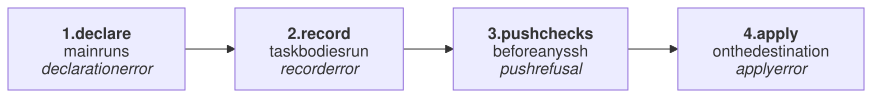

# 15. When things go wrong

gonf sorts every failure into one of four classes, and each stops at a
different point. Knowing the class tells you where to look.

> 🦫 **Gonfy says:** When the dam leaks, read the error class first. It tells you whether the leak is in a declaration, in the recording, in the push checks or at the lodge.



## The recipe

It works normally, and the environment variable `BREAK` lets you trigger
three of the classes. The `note` task triggers the fourth when you push it:

```go
// Command gonf shows gonf's error classes (tutorial chapter 15). Set
// BREAK to one of decl, record or apply to trigger one of them; pushing
// the note task triggers a push refusal.
package main

import (
	"os"

	. "github.com/snonux/gonf/api"
	"github.com/snonux/gonf/cli"
)

func main() {
	brk := os.Getenv("BREAK")
	dir := DestHome("gonf-tutorial/trouble")

	if brk == "decl" {
		// Declaration error: line edits cannot be combined with content.
		File("/tmp/broken.conf", WithContent("a=1\n"), WithLines("b=2"))
	}

	Task("setup", "Create the working directory", func() { Dir(dir, WithMode(0o755)) })
	Task("app", "Write the app config", func() {
		File(dir+"/app.conf", WithContent("ok\n"), WithMode(0o644))
		if brk == "apply" {
			// Apply error: the command fails on the destination.
			Command("false", nil, WithName("always-fails"))
		}
	}, Needs(needed(brk)))
	// An opaque guard: plain Go that only the controller can evaluate, so
	// push refuses this task. WhenLinux() would travel in the plan.
	Task("note", "Write a note on Linux", func() {
		File(dir+"/note", WithContent("Gonfy was here\n"), WithMode(0o644))
	}, When(func(f Facts) bool { return f.GOOS == "linux" }), Needs("setup"))
	cli.Main()
}

// needed names the task app needs; BREAK=record names one that does not
// exist, which fails when the plan is recorded.
func needed(brk string) string {
	if brk == "record" {
		return "setpu"
	}
	return "setup"
}
```

```text
$ ./gonf app
2026/09/26 08:23:23 created directory /home/paul/gonf-tutorial/trouble
2026/09/26 08:23:23 updated /home/paul/gonf-tutorial/trouble/app.conf
summary: 0 ok, 2 changed, 0 skipped, 0 would-change
```

## Declaration errors

DSL misuse is found while `main` declares things, before any task runs. The
error names your source line, and every command refuses to run, even
`-list`:

```text
$ BREAK=decl ./gonf -list
2026/09/26 08:23:23 file /tmp/broken.conf: WithLine(s)/WithoutLine(s)/WithKeyedLine/WithBlock cannot be combined with WithContent/WithSource
2026/09/26 08:23:23 declared at /home/paul/gonf/docs/tutorial/examples/ch15-troubleshooting/main.go:20
[exit status 1]
```

A program that uses gonf as a library (chapter 17) can clear a
declaration error with `resource.ResetDeclarationError()` and carry on.
`cli.Main()` never does: fix the recipe line instead.

## Record errors

> 🦫 **Gonfy says:** A record error stops me before I pick up a single stick. Nothing was changed.

The recipe compiles and declares fine, but recording the task fails, so
nothing is applied:

```text
$ BREAK=record ./gonf app
error: task "app" needs unknown task "setpu"
[exit status 1]
```

Other record errors: an unknown task on the command line, a dependency
cycle, a missing secret (chapter 13).

```text
$ ./gonf nosuchtask
error: unknown task "nosuchtask"
[exit status 1]
```

## Push refusals

> 🦫 **Gonfy says:** Some chores cannot travel. gonf tells me so before I even get my paws wet.

Before `push`, `cluster` or `fleet` opens an ssh connection, gonf checks
that the plan can work on the host. `note` has an opaque `When(func)`
guard (chapter 9), which cannot travel in a plan, so gonf refuses to push
it. Nothing is sent and nothing changes:

```text
$ ./gonf push -privilege=sudo paul@earth.lan note
push: push: task(s) note use When(func) with no serializable guard (WhenLinux/WhenProfile/WhenHostnameContains); shipping this plan would drop the guard entirely and apply the task unconditionally on the destination — refusing to push
[exit status 1]
```

The fix here is `WhenLinux()`, which the host can check itself. Another
common push refusal is a plan with privileged ops for a host without sudo
or doas (chapter 10).

## Apply errors

> 🦫 **Gonfy says:** An apply error happened at the lodge. The ops before it were already applied, and the error names the plan line that sprang the leak.

A resource failed on the destination. The ops before it were applied, the
error names the plan line, and the exit status is 1:

```text
$ BREAK=apply ./gonf app
2026/09/26 08:23:23 running Command[always-fails]: false 
summary: 2 ok, 0 changed, 0 skipped, 0 would-change
error: chunk 0: plan: apply line 4: false exited 1
stdout: 
stderr: 
[exit status 1]
```

## Interrupting a run

> 🦫 **Gonfy says:** Tap me once and I finish the stick in my paws and stop. Tap me twice and I drop everything.

Ctrl-C (SIGINT), SIGTERM and SIGHUP cancel a run cleanly:

- The command that is running gets SIGTERM, and SIGKILL 10 seconds later
  if it is still there. No further op starts, and gonf cleans up its
  temporary files.
- A second Ctrl-C makes gonf exit at once, without cleaning up. Only
  `gonf apply` ignores it and always finishes stopping cleanly.
- A validator (chapter 4) is not stopped by the signal, only by
  `-cmd-timeout`, and its result is thrown away.
- Under `nohup`, which ignores SIGHUP, a closed terminal does not stop the
  run.
- Interrupting `push`, `cluster` or `fleet` stops the local `ssh` only. The
  `gonf apply` already running on a host finishes its plan.

## Slow and unreachable hosts

Every push is bounded, so a dead host cannot hang your gonf forever:

| Limit | Bounds | Default |
|-------|--------|---------|
| `-host-timeout` (`cluster`, `fleet`) | one host's whole push | 10m; `0` means no limit |
| a single `push` | the whole push | 10m |
| ssh `ConnectTimeout` | connecting and logging in | 15s |
| ssh `ServerAliveInterval` × `ServerAliveCountMax` | a network path that went silent | 15s × 4, about a minute |
| `-cmd-timeout` | one backend command or validator | 5m |

gonf adds the two ssh options itself. An explicit `-o ConnectTimeout=...`
after `--` in `push` (chapter 12) wins. Like an interrupt, a timeout stops
only the local `ssh`: the host's `gonf apply` has no overall timeout.

The first push to a host builds gonf for it (chapter 12). When that step
fails, check these:

- The controller needs Go and gonf's module, because gonf runs `go build`
  for the host's platform.
- The platform comes from `uname -s` and `uname -m` on the host. When
  `uname -m` names a board rather than a CPU (NetBSD says `evbarm` on a
  Raspberry Pi), gonf asks `uname -p`. `WithPlatform("netbsd/arm64")` in
  the inventory skips the question.
- The build happens in a private directory below `$TMPDIR` (default
  `/tmp`). `$TMPDIR` and every directory above it must belong to you or
  root, and others may write to them only with the sticky bit set, as on
  `/tmp`. In a container where that fails, point `TMPDIR` at a directory
  you own.

## Exit codes

| Code | Meaning |
|------|---------|
| 0 | success, dry runs included |
| 1 | any error above |
| 2 | usage error, such as an unknown flag |

```text
$ ./gonf -n app; echo "exit $?"
summary: 2 ok, 0 changed, 0 skipped, 0 would-change
exit 0
```

## Tools for digging

> 🦫 **Gonfy says:** When in doubt, `-verbose` shows every step I take.

| Tool | Use it to |
|------|-----------|
| `-n` | see what would change |
| `-verbose` | see every probe and step, and command output; on a push, the hosts log verbosely too |
| `-quiet` | see only warnings, errors and the summaries |
| `-cmd-timeout 10m` | give slow commands (package installs, validators) more than the default 5 minutes |
| `plan -redacted tasks...` | read exactly what was recorded, guards included |
| `-list` | see which tasks are guarded away on this host |
| `-version`, `-plan-version` | compare the controller's and the host's gonf |

A few things that often surprise:

- A `File` without `WithMode` is `0640`, even when the file was `0644`.
- `${HOME}` (from `DestHome`) expands in paths, not in command arguments or
  file content.
- An `if` in a task body runs on the controller; use a guard (chapter 9).
- `Home` is the controller's home; for targets use `DestHome`.

Reference: [Error handling](../reference.md#error-handling),
[CLI](../reference.md#cli).

---

← [14. Sealed and signed plans](14-sealed-signed.md) · [Contents](README.md) · Next: [16. A web fleet](16-web-fleet.md) →
