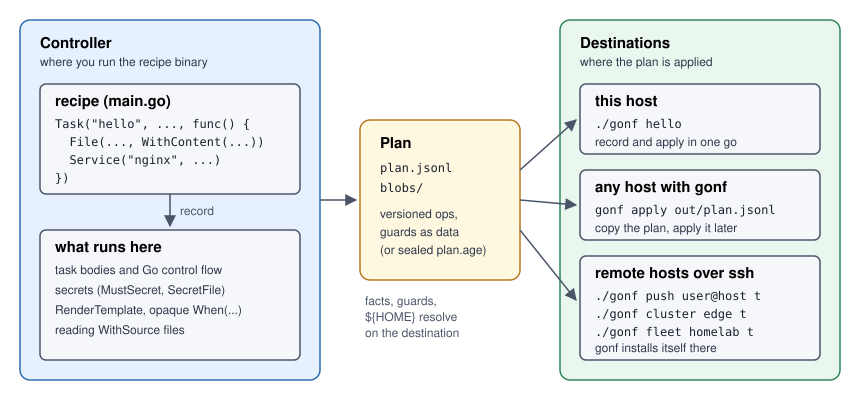

# The gonf tutorial

A step-by-step book about gonf, from a first recipe to sealed plans pushed to
a fleet. Every chapter builds a small recipe, runs it, and shows the real
commands and their output. Each section ends with links into the
[reference](../reference.md), which has every option and every sharp edge.



## Chapters

| # | Chapter | You learn |
|---|---------|-----------|
| 1 | [How gonf works](01-how-gonf-works.md) | Recipes, tasks, resources, plans, controller and destination |
| 2 | [Your first recipe](02-first-recipe.md) | A Go module, `-list`, dry runs, applying, idempotence |
| 3 | [Files, directories and links](03-files.md) | `File`, `Dir`, tree and glob syncs, pruning, `Symlink`, `EnsureFile` |
| 4 | [Editing and validating files](04-editing-files.md) | Owned lines, keyed lines, shell variables, blocks, validators, `ConfigSet` |
| 5 | [Templates](05-templates.md) | Destination templates, facts, `RenderTemplate`, `WithContentFrom` |
| 6 | [Commands and change gates](06-commands.md) | `Command`, `Sh`, guards, `OnChange`, `DependsOn`, `Noop` |
| 7 | [Packages, services, timers, cron and users](07-system-resources.md) | The system resources and how to preview them |
| 8 | [Organizing tasks](08-organizing-tasks.md) | `RegisterMethods`, companions, `gonf-desc`, aggregates, aliases, `Needs` |
| 9 | [Guards and facts](09-guards.md) | `WhenLinux`, `WhenProfile`, hostname and path guards, opaque predicates |
| 10 | [Privilege](10-privilege.md) | `Privileged`, `RequiresRoot`, root permissions, sudo and doas |
| 11 | [Plans](11-plans.md) | `gonf plan`, the plan format, blobs, `gonf apply` |
| 12 | [Inventory and remote hosts](12-remote.md) | Hosts, clusters, fleets, per-host data, `push`, `cluster`, `fleet` |
| 13 | [Secrets](13-secrets.md) | Secret providers, `MustSecret`, `SecretFile`, sensitive plans |
| 14 | [Sealed and signed plans](14-sealed-signed.md) | age encryption, signer keys, verified apply |
| 15 | [When things go wrong](15-troubleshooting.md) | Error classes, exit codes, `-verbose` |

## How to follow along

You need Go and a Linux, macOS or BSD machine. Chapter 2 starts a recipe
module of your own. From chapter 3 on, every chapter's recipe is in
[examples/](examples/), so you can also run them from a gonf checkout:

```text
$ git clone https://github.com/snonux/gonf
$ cd gonf/docs/tutorial/examples
$ go build -o recipe ./ch03-files
$ ./recipe -list
```

The examples write below `~/gonf-tutorial`, except where a chapter says it
needs root. The outputs in this book were captured on a Linux machine named
`vm`, with `HOME=/home/paul`. Your timestamps, host name and paths will
differ. A line `[exit status 1]` in an output marks a command that exited
with that status; it is not printed by the command itself.

The examples are compiled by gonf's CI together with the rest of the
module, so they keep up with the DSL.
